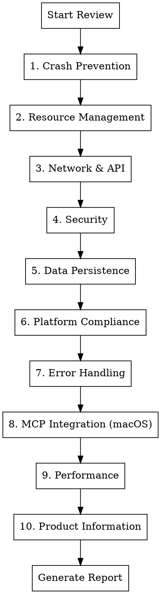
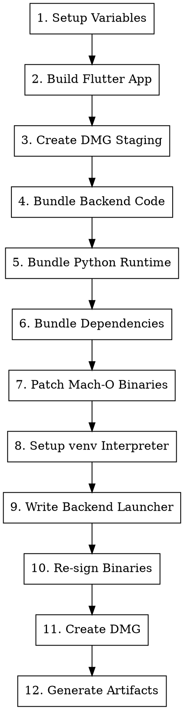

# OSX Skills for Claude Code

Production-ready skills for verifying and shipping macOS applications with Claude Code.

## Overview

This repository ships two release skills:

### 1. `osx-app-compliance-check`

**Infrastructure audit skill** that verifies all macOS app projects have proper DMG creation scripts, release notes, automatic versioning, license files, and distribution infrastructure.

- Audits all projects in `artifacts/code/*PRJ/`
- Checks for required files (RELEASE_NOTES.md, LICENSE.md, build scripts)
- Verifies build script features (SHA256, auto version, license embedding)
- Produces compliance report
- Can automatically fix missing components

**Use when:** Setting up new projects, periodic audits, before releases, after infrastructure changes.

Primary source of truth: `skills/osx-app-compliance-check/SKILL.md`

### 2. `app-store-code-review`

**Code quality skill** for systematic review of applications targeting Apple App Store, Google Play, or desktop distribution. It identifies crash risks, security vulnerabilities, resource leaks, and compliance issues that cause rejection or poor user experience. It includes a mandatory cross-repo consistency pass for macOS app websites + README licensing language before release.

**Use when:** Before App Store submission, before production release, after major features.

Primary source of truth: `skills/app-store-code-review/SKILL.md`

## Skill Relationship

```
osx-app-compliance-check          app-store-code-review
        |                                  |
        v                                  v
  Infrastructure                     Code Quality
  - DMG scripts                      - Crash prevention
  - Release notes                    - Resource management
  - Versioning                       - Security
  - License files                    - Platform compliance
  - Build features                   - MCP integration
        |                                  |
        +-----------> RELEASE <------------+
```

Run `osx-app-compliance-check` first to ensure infrastructure is in place, then run `app-store-code-review` for code quality verification.

## Rationale

Shipping desktop apps fails most often at integration boundaries, not in isolated feature code. This skill exists to prevent:

- App Store rejection from missing manifests, entitlements, legal pages, or metadata
- Production incidents caused by lifecycle misuse (`setState` after dispose, leaked timers/subscriptions, force unwraps)
- Security regressions (weak input validation, permissive CORS, secrets in source)
- Distribution defects (unsigned/unnotarized DMGs, missing hashes, missing bundled license files)
- Cross-repo drift between app code, website legal text, and README license language
- AI-integration gaps where macOS apps ship without MCP parity and testable tool contracts

## When to Use the Skill

Use `app-store-code-review`:

- Before App Store or Play Store submission
- Before any production release
- After major feature milestones
- When a request includes words like `ship`, `release`, `production`, `App Store`
- For Flutter, Swift, Kotlin, React Native, and Python-backend app stacks
- When reviewing cross-platform apps

## Mandatory Workspace Layout

For macOS app projects in this workspace, the skill enforces:

- `artifacts/code/<AppName>PRJ/<AppName>CODE` for source code
- `artifacts/code/<AppName>PRJ/<AppName>WEB` for the static website

Legal/compliance review must cover three surfaces:

- **README surface:** `<AppName>CODE/README.md`
- **Flutter app surface:** `<AppName>CODE/flutter_app/` (legal screens + bundled app resources)
- **Website surface:** `<AppName>WEB/` (`index.html`, `license.html`, `privacy.html`, `terms.html`, `privacy-consent.js`)

Do not use `artifacts/all-web` for these macOS app sites.

## Review Flow

The skill requires a full sequential pass across ten categories:



No category is optional in a release review.

## Severity Model

| Severity | Definition | Action |
|----------|------------|--------|
| **Critical** | Will cause crashes, data loss, or rejection | Must fix before submission |
| **High** | Likely to cause issues under normal use | Should fix before submission |
| **Medium** | Edge cases, degraded experience | Fix in next release |
| **Low** | Code quality, best practices | Nice to have |

## Detailed Coverage

### 1. Crash Prevention

#### Flutter/Dart
- All async callbacks check `mounted` before `setState()`
- `StreamSubscription` cancelled in `dispose()`
- `Timer` cancelled in `dispose()`
- `AnimationController` disposed
- `TextEditingController` disposed
- `ScrollController` disposed
- `FocusNode` disposed
- Null safety: no force unwraps (`!`) without guaranteed non-null
- List/Map access with bounds checking or `.elementAtOrNull()`

#### Flutter UI Patterns (Reference: flutter-python-fullstack)
- **Theme**: Uses `ColorScheme.fromSeed()` with Material 3
- **Dark mode**: Supports `ThemeMode.system` (respects OS preference)
- **Backend check**: Health check on startup with loading/disconnected states
- **Stats polling**: Uses `Future.doWhile()` with `mounted` guard
- **Status chips**: Color-coded (green/orange/red) using `withValues(alpha:)`
- **Deprecated APIs**: No `withOpacity()` (use `withValues(alpha:)` instead)
- **ApiService**: Centralized HTTP client with typed endpoints

#### iOS/Swift
- No force unwraps (`!`) on optionals from external data
- `weak self` in closures to prevent retain cycles
- `deinit` called (add print to verify during testing)
- No unhandled `fatalError()` or `preconditionFailure()`

#### Android/Kotlin
- Null checks on Intent extras
- Activity lifecycle handled (no operations on destroyed activity)
- Fragment lifecycle handled
- No `!!` on nullable external data

#### Backend/Python
- All exceptions caught at API boundary
- No bare `except:` clauses (catch specific exceptions)
- Thread safety for shared resources
- Connection pool limits configured

### 2. Resource Management

#### Memory Leaks
- Large objects released when not needed
- Image/media caching bounded
- Listeners/observers removed
- Background tasks cancelled on screen exit
- File handles closed in finally blocks
- Voice-clone pipelines profiled with Instruments (Allocations + Leaks) for full clone lifecycle
- Add standalone clone regression tests using `Natasha` and `Suzan` voices to detect runaway memory growth

#### File System
- Temp files cleaned up
- File existence checked before read
- File permissions checked
- Path sanitization (no `../` injection)
- Disk space checked before large writes

#### Audio/Video
- Players disposed when done
- Audio session properly configured
- Background audio handled correctly
- Interruption handling (phone calls)

### 3. Network & API Resilience

#### Timeouts
- All HTTP requests have timeout configured
- Reasonable timeout values (10-30s for normal, 60-120s for uploads)
- Timeout errors handled gracefully

#### Error Handling
- Network unavailable handled
- Server errors (5xx) handled
- Client errors (4xx) handled with user feedback
- Malformed response handled
- Empty response handled

#### Resilience
- Retry logic with exponential backoff
- Circuit breaker for failing services
- Offline mode / cached data fallback
- Request cancellation on screen exit

#### Configuration
- Base URL configurable (not hardcoded localhost)
- API version handling
- Certificate pinning (if required)

### 4. Security

#### Input Validation
- All user input validated
- Path traversal prevention (`../`)
- SQL injection prevention (parameterized queries)
- XSS prevention (output encoding)
- File type validation for uploads

#### Authentication
- Tokens stored securely (Keychain/Keystore)
- Token refresh logic
- Session expiration handling
- Logout clears all sensitive data

#### Network Security
- HTTPS only (no HTTP except localhost)
- CORS configured properly (not `*` in production)
- Sensitive data not logged
- API keys not in source code

#### Data Protection
- Sensitive data encrypted at rest
- No sensitive data in logs
- No sensitive data in crash reports
- Clipboard cleared after paste of sensitive data

### 5. Data Persistence

#### Database
- Schema migrations for updates
- Database connection pooling
- Thread-safe access (locking or connection per thread)
- Backup/restore capability
- Corruption recovery

#### Preferences/Settings
- Default values for all settings
- Settings validation on load
- Settings migration for app updates

#### Cache
- Cache size limits
- Cache expiration
- Cache invalidation logic
- Graceful handling of corrupted cache

### 6. Platform Compliance

#### Apple App Store
- Privacy manifest (PrivacyInfo.xcprivacy) present
- Required device capabilities declared
- App Transport Security configured
- No private API usage
- Proper entitlements configured
- App icons all sizes present
- Launch screen configured

#### Google Play
- Target SDK meets requirements
- Permissions declared and justified
- Data safety form ready
- 64-bit support
- App bundle (not APK)

#### macOS App Store
- Sandboxing configured
- Hardened runtime enabled
- Notarization ready
- Entitlements minimal and justified

#### macOS Direct Distribution
- DMG builder script present (`scripts/build_dmg.sh`)
- DMG includes app bundle, Applications symlink, and background image
- Code signing for DMG distribution
- Notarization of DMG for Gatekeeper
- Volume name and window layout configured
- SHA256 hash generated alongside DMG (`.dmg.sha256`)
- Version extracted from centralized version file
- DMG root includes `LICENSE` (source) and `BINARY-LICENSE.txt` (binary/EULA)
- App bundle embeds `Contents/Resources/LICENSE` and `Contents/Resources/BINARY-LICENSE.txt`
- DMG license agreement configured (when supported by the DMG toolchain)

## DMG Creation Scripts: Complete Reference

This section provides a comprehensive guide to creating production-ready DMG installers for macOS apps with bundled Python backends.

### Architecture Overview



### Script Structure and Variables

```bash
#!/bin/bash
set -euo pipefail

# Directory resolution
SCRIPT_DIR="$(cd "$(dirname "$0")" && pwd)"
PROJECT_DIR="$(dirname "$SCRIPT_DIR")"

# App configuration
APP_NAME="<AppName>"
ARCH="$(uname -m)"                          # arm64 or x86_64
BUILD_DIR="$PROJECT_DIR/build"
DIST_DIR="$PROJECT_DIR/dist"
DMG_STAGE_DIR="$BUILD_DIR/dmg-stage"
APP_BUNDLE="$DMG_STAGE_DIR/$APP_NAME.app"
APP_RESOURCES="$APP_BUNDLE/Contents/Resources"
BUNDLED_BACKEND="$APP_RESOURCES/backend"
BUNDLED_PYTHON="$APP_RESOURCES/python"
MLX_ONLY_BUILD="${MLX_ONLY_BUILD:-1}"       # Set to 0 to include torch
```

### Version Extraction from Centralized Version File

```bash
read_version_field() {
    local field="$1"
    python3 - <<PY
namespace = {}
with open("$PROJECT_DIR/backend/version.py", "r", encoding="utf-8") as f:
    exec(f.read(), namespace)
print(namespace["$field"])
PY
}

VERSION="$(read_version_field VERSION)"
BUILD_NUMBER="$(read_version_field BUILD_NUMBER)"
```

The corresponding `backend/version.py`:

```python
VERSION = "2026.02.1"
BUILD_NUMBER = 42
VERSION_NAME = "Sunrise"
```

### Python Environment Resolution

```bash
# Find the source virtual environment
resolve_source_venv() {
    if [ -d "$PROJECT_DIR/backend/venv" ]; then
        echo "$PROJECT_DIR/backend/venv"
        return
    fi
    if [ -d "$PROJECT_DIR/venv" ]; then
        echo "$PROJECT_DIR/venv"
        return
    fi
    die "No Python virtual environment found."
}

# Find the base Python installation (e.g., Homebrew Python)
resolve_python_home() {
    local source_venv="$1"
    local cfg="$source_venv/pyvenv.cfg"
    local home=""

    if [ -f "$cfg" ]; then
        home="$(awk -F ' = ' '/^home = / { print $2; exit }' "$cfg" || true)"
    fi

    if [ -n "$home" ] && [ -d "$home" ]; then
        echo "${home%/bin}"
        return
    fi

    # Fallback: follow python3 symlink
    local py3_target
    py3_target="$(readlink "$source_venv/bin/python3" 2>/dev/null || true)"
    if [ -n "$py3_target" ] && [ -d "${py3_target%/bin/*}" ]; then
        echo "${py3_target%/bin/*}"
        return
    fi

    die "Unable to resolve base Python installation"
}

# Extract Python version tag (e.g., python3.11)
resolve_python_tag() {
    local source_venv="$1"
    local py_lib
    py_lib="$(find "$source_venv/lib" -maxdepth 1 -type d -name 'python*' | head -n 1)"
    basename "$py_lib"
}

SOURCE_VENV="$(resolve_source_venv)"
PYTHON_HOME="$(resolve_python_home "$SOURCE_VENV")"
PYTHON_TAG="$(resolve_python_tag "$SOURCE_VENV")"   # e.g., python3.11
PYTHON_SHORT="${PYTHON_TAG#python}"                 # e.g., 3.11
```

### Building Flutter macOS App

```bash
log "Building Flutter app..."
cd "$PROJECT_DIR/flutter_app"
flutter build macos --release

RELEASE_DIR="$PROJECT_DIR/flutter_app/build/macos/Build/Products/Release"
FLUTTER_APP=""
for candidate in "<appname>_studio.app" "$APP_NAME.app"; do
    if [ -d "$RELEASE_DIR/$candidate" ]; then
        FLUTTER_APP="$RELEASE_DIR/$candidate"
        break
    fi
done
[ -n "$FLUTTER_APP" ] && [ -d "$FLUTTER_APP" ] || die "Flutter build failed"
```

### DMG Staging Directory Setup

```bash
log "Preparing DMG staging..."
rm -rf "$DMG_STAGE_DIR"
mkdir -p "$DMG_STAGE_DIR"

# Copy Flutter app bundle
cp -R "$FLUTTER_APP" "$APP_BUNDLE"

# Create Applications symlink for drag-to-install
ln -sfn /Applications "$DMG_STAGE_DIR/Applications"
```

**Final staging directory structure:**
```
build/dmg-stage/
├── <AppName>.app/
│   └── Contents/
│       ├── Info.plist
│       ├── MacOS/
│       │   └── <AppName>
│       └── Resources/
│           ├── backend/
│           ├── python/
│           └── ...
└── Applications -> /Applications
```

### Bundling Backend Source Code

```bash
log "Bundling backend source..."
mkdir -p "$BUNDLED_BACKEND"
rsync -a \
    --delete \
    --exclude '__pycache__/' \
    --exclude '.pytest_cache/' \
    --exclude '*.pyc' \
    --exclude '*.pyo' \
    --exclude '.DS_Store' \
    --exclude 'tests/' \
    --exclude 'venv/' \
    --exclude 'models/' \
    --exclude 'outputs/' \
    --exclude '*.db' \
    "$PROJECT_DIR/backend/" \
    "$BUNDLED_BACKEND/"

# Preserve model registry .py files without heavyweight model payloads
mkdir -p "$BUNDLED_BACKEND/models" "$BUNDLED_BACKEND/outputs"
if [ -d "$PROJECT_DIR/backend/models" ]; then
    rsync -a \
        --exclude '__pycache__/' \
        --exclude '*.pyc' \
        --include '*/' \
        --include '*.py' \
        --exclude '*' \
        "$PROJECT_DIR/backend/models/" \
        "$BUNDLED_BACKEND/models/"
fi
```

### Bundling Python Runtime

```bash
log "Bundling Python runtime..."
mkdir -p "$BUNDLED_PYTHON"
rsync -a \
    --delete \
    --exclude '__pycache__/' \
    --exclude '.DS_Store' \
    --exclude 'share/' \
    --exclude 'lib/python*/site-packages/' \
    --exclude 'lib/python*/test/' \
    "$PYTHON_HOME/" \
    "$BUNDLED_PYTHON/"
```

This copies the entire Python installation (typically from Homebrew) but excludes site-packages (which come from the venv) and test directories.

### Bundling Backend Dependencies from venv

```bash
log "Bundling backend dependencies..."
rm -rf "$BUNDLED_BACKEND/venv"
cp -R "$SOURCE_VENV" "$BUNDLED_BACKEND/venv"

# Clean up unnecessary files
rm -rf "$BUNDLED_BACKEND/venv/include" "$BUNDLED_BACKEND/venv/share"
find "$BUNDLED_BACKEND/venv" -type d -name '__pycache__' -prune -exec rm -rf {} + 2>/dev/null || true
find "$BUNDLED_BACKEND/venv" -type d -name 'tests' -prune -exec rm -rf {} + 2>/dev/null || true
find "$BUNDLED_BACKEND/venv" -type f \( -name '*.pyc' -o -name '*.pyo' \) -delete 2>/dev/null || true
find "$BUNDLED_BACKEND/venv" -name '.DS_Store' -type f -delete 2>/dev/null || true
```

### MLX-Only Build Pruning (Optional)

For Apple Silicon MLX-only builds, remove PyTorch and other heavyweight packages:

```bash
if [ "$MLX_ONLY_BUILD" = "1" ]; then
    log "Pruning non-MLX payloads..."
    BUNDLED_SITE_PACKAGES="$BUNDLED_BACKEND/venv/lib/$PYTHON_TAG/site-packages"
    if [ -d "$BUNDLED_SITE_PACKAGES" ]; then
        for pattern in \
            "torch" "torch-*.dist-info" \
            "torchaudio" "torchaudio-*.dist-info" \
            "torchgen" \
            "gradio" "gradio-*.dist-info" \
            "pandas" "pandas-*.dist-info" \
            "matplotlib" "matplotlib-*.dist-info" \
            "pip" "pip-*.dist-info" \
            "setuptools" "setuptools-*.dist-info"; do
            find "$BUNDLED_SITE_PACKAGES" -maxdepth 1 -name "$pattern" \
                -exec rm -rf {} + 2>/dev/null || true
        done
    fi
fi
```

### Mach-O Binary Patching for Portability

This is the most critical section for creating portable app bundles. It rewrites absolute dylib paths to `@loader_path`-relative references.

#### Helper Functions

```bash
# Check if file is a Mach-O binary
is_macho_file() {
    local f="$1"
    [ -f "$f" ] || return 1
    file "$f" 2>/dev/null | grep -q "Mach-O"
}

# Check if dependency is a system library (should not be vendored)
is_system_dep() {
    local dep="$1"
    case "$dep" in
        @*)                                           return 0 ;;  # Already relative
        /usr/lib/*)                                   return 0 ;;  # System libs
        /System/Library/*)                            return 0 ;;  # System frameworks
        /System/Volumes/Preboot/Cryptexes/OS/usr/lib/*) return 0 ;;  # macOS 13+ system
    esac
    return 1
}

# Calculate @loader_path-relative reference
loader_ref_to_python_lib() {
    local from_file="$1"
    local to_file="$2"
    python3 - <<PY
import os
from_dir = os.path.dirname(os.path.abspath("$from_file"))
to_file = os.path.abspath("$to_file")
rel = os.path.relpath(to_file, from_dir).replace("\\\\", "/")
print(f"@loader_path/{rel}")
PY
}
```

#### Main Patching Function

```bash
patch_macho_deps() {
    local bin="$1"
    is_macho_file "$bin" || return 0

    local dep
    while IFS= read -r dep; do
        [ -n "$dep" ] || continue
        if is_system_dep "$dep"; then
            continue
        fi

        local resolved_dep="$dep"
        local dep_name dep_pkg dep_pkg_candidate
        dep_name="$(basename "$dep")"

        # Handle wheel-local .dylibs directories
        if [ ! -f "$resolved_dep" ]; then
            if [[ "$dep" == */.dylibs/* ]]; then
                dep_pkg="$(echo "$dep" | sed -E 's#.*/([^/]+)/\.dylibs/.*#\1#')"
                dep_pkg_candidate="$BUNDLED_BACKEND/venv/lib/$PYTHON_TAG/site-packages/$dep_pkg/.dylibs/$dep_name"
                if [ -f "$dep_pkg_candidate" ]; then
                    resolved_dep="$dep_pkg_candidate"
                fi
            fi
        fi

        # Try local .dylibs directories
        if [ ! -f "$resolved_dep" ]; then
            local dep_local1 dep_local2
            dep_local1="$(dirname "$bin")/.dylibs/$dep_name"
            dep_local2="$(dirname "$(dirname "$bin")")/.dylibs/$dep_name"
            if [ -f "$dep_local1" ]; then
                resolved_dep="$dep_local1"
            elif [ -f "$dep_local2" ]; then
                resolved_dep="$dep_local2"
            fi
        fi

        if [ ! -f "$resolved_dep" ]; then
            log "Warning: unresolved dependency for $(basename "$bin"): $dep"
            continue
        fi

        # Copy dependency to bundled python lib
        local dep_dst dep_ref
        dep_dst="$BUNDLED_PYTHON/lib/$dep_name"

        if [ ! -f "$dep_dst" ]; then
            cp -f "$resolved_dep" "$dep_dst"
            chmod 755 "$dep_dst" 2>/dev/null || true
        fi

        # Rewrite the reference
        dep_ref="$(loader_ref_to_python_lib "$bin" "$dep_dst")"
        install_name_tool -change "$dep" "$dep_ref" "$bin" 2>/dev/null || true
    done < <(otool -L "$bin" 2>/dev/null | awk 'NR>1 {print $1}')

    # Normalize install-id for vendored dylibs
    case "$bin" in
        *.dylib)
            install_name_tool -id "@loader_path/$(basename "$bin")" "$bin" 2>/dev/null || true
            ;;
    esac
}
```

#### Multi-Pass Vendoring

Multiple passes catch dependencies of newly-vendored dylibs:

```bash
vendor_python_runtime_deps() {
    local tmp_list pass
    tmp_list="$(mktemp)"

    # Seed with executables and extension modules
    find "$BUNDLED_PYTHON/bin" -maxdepth 1 -type f > "$tmp_list"
    find "$BUNDLED_PYTHON/lib" -type f \( -name "*.so" -o -name "*.dylib" \) >> "$tmp_list"
    find "$BUNDLED_BACKEND/venv/lib/$PYTHON_TAG/site-packages" \
        -type f \( -name "*.so" -o -name "*.dylib" \) >> "$tmp_list" 2>/dev/null || true

    # Multiple passes for transitive dependencies
    for pass in 1 2 3 4 5 6; do
        while IFS= read -r candidate; do
            [ -n "$candidate" ] || continue
            patch_macho_deps "$candidate"
        done < "$tmp_list"

        # Refresh list to include newly-vendored dylibs
        find "$BUNDLED_PYTHON/bin" -maxdepth 1 -type f > "$tmp_list"
        find "$BUNDLED_PYTHON/lib" -type f \( -name "*.so" -o -name "*.dylib" \) >> "$tmp_list"
        find "$BUNDLED_BACKEND/venv/lib/$PYTHON_TAG/site-packages" \
            -type f \( -name "*.so" -o -name "*.dylib" \) >> "$tmp_list" 2>/dev/null || true
    done

    rm -f "$tmp_list"
}

vendor_python_runtime_deps
```

### Setting Up the Bundled venv Interpreter

```bash
# Remove old symlinks
rm -f "$BUNDLED_BACKEND/venv/bin/python" \
      "$BUNDLED_BACKEND/venv/bin/python3" \
      "$BUNDLED_BACKEND/venv/bin/python$PYTHON_SHORT"

# Copy real interpreter (avoid dyld issues with symlinks under app translocation)
cp -f "$BUNDLED_PYTHON/bin/$BUNDLED_PY_EXEC" "$BUNDLED_BACKEND/venv/bin/python3"
chmod 755 "$BUNDLED_BACKEND/venv/bin/python3"

# Rewrite venv interpreter dependencies to point to bundled python lib
while IFS= read -r dep; do
    [ -n "$dep" ] || continue
    case "$dep" in
        /usr/lib/*|/System/Library/*|/System/Volumes/Preboot/Cryptexes/OS/usr/lib/*)
            continue ;;
    esac
    dep_name="$(basename "$dep")"
    install_name_tool \
        -change "$dep" "@loader_path/../../../python/lib/$dep_name" \
        "$BUNDLED_BACKEND/venv/bin/python3" 2>/dev/null || true
done < <(otool -L "$BUNDLED_BACKEND/venv/bin/python3" 2>/dev/null | awk 'NR>1 {print $1}')

# Create symlinks
ln -sf "python3" "$BUNDLED_BACKEND/venv/bin/python"
ln -sf "python3" "$BUNDLED_BACKEND/venv/bin/python$PYTHON_SHORT"

# Write pyvenv.cfg with relative paths
cat > "$BUNDLED_BACKEND/venv/pyvenv.cfg" <<CFG
home = ../python/bin
include-system-site-packages = false
version = ${PYTHON_SHORT}.0
executable = ../python/bin/$BUNDLED_PY_EXEC
CFG
```

### Backend Launcher Script

The launcher script sets up the runtime environment and starts the backend:

```bash
cat > "$BUNDLED_BACKEND/run_backend.sh" <<'LAUNCHER'
#!/bin/bash
set -euo pipefail

SCRIPT_DIR="$(cd "$(dirname "$0")" && pwd)"
RESOURCES_DIR="$(dirname "$SCRIPT_DIR")"
APP_NAME="<AppName>"

# User-writable runtime directories (NOT in app bundle)
APP_SUPPORT_DIR="${HOME}/Library/Application Support/${APP_NAME}"
APP_CACHE_DIR="${HOME}/Library/Caches/${APP_NAME}"
APP_LOG_DIR="${HOME}/Library/Logs/${APP_NAME}"

mkdir -p "$APP_SUPPORT_DIR" "$APP_CACHE_DIR" "$APP_LOG_DIR"

# Log file setup with fallback
LOG_FILE="$APP_LOG_DIR/backend.log"
if ! touch "$LOG_FILE" 2>/dev/null; then
    LOG_FILE="/tmp/<appname>-backend.log"
    touch "$LOG_FILE"
fi

BACKEND_PORT="${<APPNAME>_BACKEND_PORT:-7693}"
PYTHON_BIN="$SCRIPT_DIR/venv/bin/python3"
[ -x "$PYTHON_BIN" ] || { echo "Bundled Python not found" >&2; exit 1; }

# Resolve bundled site-packages dynamically
SITE_PACKAGES_DIR=""
for candidate in "$SCRIPT_DIR"/venv/lib/python*/site-packages; do
    if [ -d "$candidate" ]; then
        SITE_PACKAGES_DIR="$candidate"
        break
    fi
done
[ -n "$SITE_PACKAGES_DIR" ] || { echo "site-packages not found" >&2; exit 1; }

# Environment configuration
export PYTHONUNBUFFERED=1
export PYTHONPYCACHEPREFIX="$APP_CACHE_DIR/pycache"
export XDG_CACHE_HOME="$APP_CACHE_DIR"
export <APPNAME>_RUNTIME_HOME="$APP_SUPPORT_DIR"
export <APPNAME>_DATA_DIR="$APP_SUPPORT_DIR/data"
export <APPNAME>_LOG_DIR="$APP_LOG_DIR"
export <APPNAME>_OUTPUT_DIR="$APP_SUPPORT_DIR/outputs"
export HF_HOME="$APP_SUPPORT_DIR/huggingface"
export HUGGINGFACE_HUB_CACHE="$HF_HOME/hub"
export TRANSFORMERS_CACHE="$HUGGINGFACE_HUB_CACHE"
export PYTHONPATH="$SCRIPT_DIR:$SITE_PACKAGES_DIR${PYTHONPATH:+:$PYTHONPATH}"

mkdir -p "$<APPNAME>_DATA_DIR" "$<APPNAME>_OUTPUT_DIR" "$HUGGINGFACE_HUB_CACHE"

cd "$SCRIPT_DIR"
exec "$PYTHON_BIN" -m uvicorn main:app --host 127.0.0.1 --port "$BACKEND_PORT" >> "$LOG_FILE" 2>&1
LAUNCHER
chmod +x "$BUNDLED_BACKEND/run_backend.sh"
```

**Key environment variables for bundled apps:**

| Variable | Purpose | Example Value |
|----------|---------|---------------|
| `PYTHONUNBUFFERED` | Immediate log output | `1` |
| `PYTHONPYCACHEPREFIX` | Redirect __pycache__ to writable location | `~/Library/Caches/App/pycache` |
| `XDG_CACHE_HOME` | General cache directory | `~/Library/Caches/App` |
| `HF_HOME` | Hugging Face home (models) | `~/Library/Application Support/App/huggingface` |
| `HUGGINGFACE_HUB_CACHE` | Model cache location | `$HF_HOME/hub` |
| `PYTHONPATH` | Module search path | `backend:site-packages` |

### Code Signing Bundled Binaries

```bash
log "Re-signing bundled runtime binaries..."
while IFS= read -r candidate; do
    [ -n "$candidate" ] || continue
    is_macho_file "$candidate" || continue
    codesign --force --sign - "$candidate" >/dev/null 2>&1 || true
done < <(
    {
        find "$BUNDLED_PYTHON/bin" -maxdepth 1 -type f 2>/dev/null
        find "$BUNDLED_PYTHON/lib" -type f \( -name "*.so" -o -name "*.dylib" \) 2>/dev/null
        find "$BUNDLED_BACKEND/venv/bin" -maxdepth 1 -type f 2>/dev/null
        find "$BUNDLED_BACKEND/venv/lib/$PYTHON_TAG/site-packages" \
            -type f \( -name "*.so" -o -name "*.dylib" \) 2>/dev/null
    } | sort -u
)
```

The `--sign -` creates an ad-hoc signature. For distribution, replace with your Developer ID certificate.

### Creating the DMG

```bash
DMG_NAME="$APP_NAME-$VERSION-$ARCH.dmg"
DMG_PATH="$DIST_DIR/$DMG_NAME"

log "Creating DMG: $DMG_NAME"
rm -f "$DMG_PATH"

# Prefer create-dmg for prettier results
if command -v create-dmg >/dev/null 2>&1; then
    create-dmg \
        --volname "$APP_NAME" \
        --window-pos 200 120 \
        --window-size 700 430 \
        --icon-size 100 \
        --icon "$APP_NAME.app" 180 200 \
        --app-drop-link 510 200 \
        --hide-extension "$APP_NAME.app" \
        "$DMG_PATH" \
        "$DMG_STAGE_DIR" || {
            # Fallback to hdiutil if create-dmg fails
            log "create-dmg failed, falling back to hdiutil"
            hdiutil create -volname "$APP_NAME" -srcfolder "$DMG_STAGE_DIR" \
                -ov -format UDZO "$DMG_PATH"
        }
else
    log "create-dmg not found, using hdiutil"
    hdiutil create -volname "$APP_NAME" -srcfolder "$DMG_STAGE_DIR" \
        -ov -format UDZO "$DMG_PATH"
fi
```

**Important:** The `hdiutil` fallback must package `$DMG_STAGE_DIR` (the whole staging directory), not just the `.app` bundle, to preserve the Applications symlink.

#### Installing create-dmg

```bash
brew install create-dmg
```

#### create-dmg Options Reference

| Option | Purpose |
|--------|---------|
| `--volname` | Volume name shown when mounted |
| `--window-pos X Y` | Initial window position |
| `--window-size W H` | Window dimensions |
| `--icon-size N` | Icon size in pixels |
| `--icon "Name.app" X Y` | Position of app icon |
| `--app-drop-link X Y` | Position of Applications symlink |
| `--hide-extension "Name.app"` | Hide .app extension |
| `--background "image.png"` | Background image for DMG window |

### Generating Release Artifacts

```bash
log "Generating SHA256..."
cd "$DIST_DIR"
shasum -a 256 "$DMG_NAME" > "$DMG_NAME.sha256"
SHA256="$(awk '{print $1}' "$DMG_NAME.sha256")"

# Copy release notes
RELEASE_NOTES_SRC="$PROJECT_DIR/RELEASE_NOTES.md"
RELEASE_NOTES_NAME="$APP_NAME-$VERSION-RELEASE_NOTES.md"
if [ -f "$RELEASE_NOTES_SRC" ]; then
    cp "$RELEASE_NOTES_SRC" "$DIST_DIR/$RELEASE_NOTES_NAME"
    shasum -a 256 "$RELEASE_NOTES_NAME" > "$RELEASE_NOTES_NAME.sha256"
fi

# Create source archive from git
SOURCE_ZIP_NAME="$APP_NAME-$VERSION-source.zip"
if git -C "$PROJECT_DIR" rev-parse --is-inside-work-tree >/dev/null 2>&1; then
    git -C "$PROJECT_DIR" archive \
        --format=zip \
        --prefix="$APP_NAME-$VERSION/" \
        -o "$DIST_DIR/$SOURCE_ZIP_NAME" \
        HEAD
    shasum -a 256 "$SOURCE_ZIP_NAME" > "$SOURCE_ZIP_NAME.sha256"
fi

log ""
log "=== Build Complete ==="
log "DMG: $DMG_PATH"
log "SHA256: $SHA256"
```

### Final dist/ Directory Structure

```
dist/
├── <AppName>-2026.02.1-arm64.dmg
├── <AppName>-2026.02.1-arm64.dmg.sha256
├── <AppName>-2026.02.1-RELEASE_NOTES.md
├── <AppName>-2026.02.1-RELEASE_NOTES.md.sha256
├── <AppName>-2026.02.1-source.zip
└── <AppName>-2026.02.1-source.zip.sha256
```

### App Bundle Final Structure

```
<AppName>.app/
└── Contents/
    ├── Info.plist
    ├── MacOS/
    │   └── <AppName>          # Flutter executable
    └── Resources/
        ├── backend/
        │   ├── main.py           # FastAPI entry point
        │   ├── version.py
        │   ├── models/           # Model registry (*.py only)
        │   ├── outputs/          # Empty directory
        │   ├── run_backend.sh    # Launcher script
        │   └── venv/
        │       ├── bin/
        │       │   ├── python3   # Real interpreter (copied, not symlinked)
        │       │   ├── python -> python3
        │       │   └── python3.11 -> python3
        │       ├── lib/
        │       │   └── python3.11/
        │       │       └── site-packages/
        │       │           ├── mlx/
        │       │           ├── uvicorn/
        │       │           └── ...
        │       └── pyvenv.cfg    # Relative paths
        ├── python/
        │   ├── bin/
        │   │   └── python3.11    # Bundled interpreter
        │   └── lib/
        │       ├── python3.11/   # Standard library
        │       ├── libssl.3.dylib        # Vendored dylibs
        │       ├── libcrypto.3.dylib
        │       └── ...
        ├── LICENSE
        └── BINARY-LICENSE.txt
```

### Troubleshooting Common Issues

| Issue | Symptom | Fix |
|-------|---------|-----|
| dyld: Library not loaded | App crashes on launch | Check `otool -L` output; ensure all deps are vendored |
| Code signature invalid | Gatekeeper blocks app | Re-sign with `codesign --force --sign -` or Developer ID |
| Python not found | Backend fails to start | Verify venv/bin/python3 is a real binary, not symlink |
| Permission denied | Backend can't write logs | Use ~/Library paths, not app bundle paths |
| Models not downloading | HF cache misconfigured | Set `HF_HOME` and `HUGGINGFACE_HUB_CACHE` env vars |
| Missing Applications link | DMG lacks drag-install | Ensure hdiutil packages $DMG_STAGE_DIR, not just .app |
| App translocation | App runs from random path | Use real binaries, not symlinks; sign properly |

### hdiutil vs create-dmg Comparison

| Feature | hdiutil | create-dmg |
|---------|---------|------------|
| Window layout | No | Yes |
| Icon positioning | No | Yes |
| Background image | Manual | Built-in |
| Hide extensions | Manual | Built-in |
| Install simplicity | Built-in | `brew install` |
| Fallback reliability | High | May fail on edge cases |

### Notarization (Production Release)

For production releases, notarize after signing:

```bash
# Sign with Developer ID
codesign --force --deep --sign "Developer ID Application: Your Name" "$APP_BUNDLE"

# Create DMG
# ... (as above)

# Submit for notarization
xcrun notarytool submit "$DMG_PATH" \
    --apple-id "your@email.com" \
    --team-id "TEAMID" \
    --password "@keychain:AC_PASSWORD" \
    --wait

# Staple the ticket
xcrun stapler staple "$DMG_PATH"
```

### Complete build_dmg.sh Template

See the full reference implementation at:
- `<AppName>CODE/scripts/build_dmg.sh`

Key characteristics:
- ~520 lines of production-tested bash
- Handles both arm64 and x86_64 builds
- MLX-only pruning for smaller Apple Silicon bundles
- Multi-pass Mach-O relocation for all transitive dependencies
- Fallback from create-dmg to hdiutil
- SHA256 hash generation for all artifacts
- Source archive via git

#### Project Scripts (Reference: flutter-python-fullstack pattern)
- **Control script** (`bin/appctl`):
  - `appctl up` - Start all services
  - `appctl down` - Stop all services
  - `appctl status` - Show running/stopped with colors
  - `appctl logs` - Tail log files
  - `appctl clean` - Clean logs and temp files
- **Install script** (`install.sh`):
  - Check/install dependencies (Homebrew, Flutter, etc.)
  - Create virtual environments
  - Download required models
  - Colored output with status indicators
- **Diagnostic script** (`issues.sh`):
  - System info (OS, architecture, disk space)
  - Tool versions (Flutter, Python, git)
  - Port status checks
  - Network/health checks
  - Last 50 lines of runtime logs
  - Timestamped output file

### 7. Error Handling

#### User Feedback
- All errors show user-friendly message
- Error messages actionable (what user can do)
- No technical jargon in user-facing errors
- Loading states for all async operations
- Empty states for lists

#### Logging
- Errors logged with context
- No sensitive data in logs
- Log levels appropriate
- Crash reporting configured

#### Recovery
- Retry option for transient failures
- Data preserved on error
- App state recoverable after crash
- Graceful degradation when features unavailable

### 8. MCP Integration (Mandatory for macOS Apps)

The skill treats MCP as required app surface for Claude interoperability. macOS apps MUST expose full functionality via MCP (Model Context Protocol) tools to enable Claude integration.

#### MCP Server Requirements
- MCP server script exists at `bin/<appname>_mcp_server.py` or similar
- Server implements JSON-RPC 2.0 over HTTP protocol
- Server handles MCP methods: `initialize`, `tools/list`, `tools/call`
- Server binds to configurable host/port (default: `127.0.0.1:80XX`)
- Server logs to `runs/logs/<appname>_mcp_server.log` with rotation
- Backend URL configurable via environment variable (e.g., `<APPNAME>_BACKEND_URL`)

#### MCP Tool Definitions
- `MCP_TOOLS` list contains all available tools
- Each tool has required keys: `name`, `description`, `inputSchema`
- Tool names are unique and follow `<domain>_<action>` pattern
- `inputSchema` is a valid JSON Schema with `type: "object"`
- Required parameters listed in `inputSchema.required` array
- Tool descriptions are clear and explain what the tool does

#### Required MCP Tools (Minimum Set)
- `health_check` - Check if backend is running and healthy
- `<domain>_status` or `system_info` - Get system/service information
- `<domain>_list_*` - List available resources (voices, models, files, etc.)
- `<domain>_<primary_action>` - Core functionality (generate, process, create)

#### MCP Tool Schema Pattern (Reference: <AppName>)

```python
MCP_TOOLS = [
    {
        "name": "app_speak",
        "description": "Generate and play speech with specified text and voice.",
        "inputSchema": {
            "type": "object",
            "properties": {
                "text": {"type": "string", "description": "Text to speak"},
                "speaker": {"type": "string", "description": "Voice/speaker name"},
                "quality_mode": {
                    "type": "string",
                    "enum": ["fast", "balanced", "quality"],
                    "description": "Quality mode (fast=realtime)"
                }
            },
            "required": ["text"]
        }
    },
    {
        "name": "app_status",
        "description": "Check service status and available resources.",
        "inputSchema": {"type": "object", "properties": {}}
    }
]
```

#### MCP Server Handler Pattern

```python
class MCPHandler(BaseHTTPRequestHandler):
    def do_POST(self):
        # Parse JSON-RPC request
        obj = json.loads(self.rfile.read(...))
        method = obj.get("method")
        params = obj.get("params") or {}

        if method == "initialize":
            # Return server info and capabilities
            return {"protocolVersion": "...", "serverInfo": {...}, "capabilities": {...}}

        if method in ("tools/list", "tools.list"):
            return {"tools": MCP_TOOLS}

        if method in ("tools/call", "tools.call"):
            result = handle_tool_call(params.get("name"), params.get("arguments"))
            return {"content": [{"type": "text", "text": result}]}
```

#### HTTP API Parity
- All MCP tools have corresponding HTTP API endpoints
- HTTP API follows RESTful conventions:
  - `GET /api/<domain>/status` - Status check
  - `GET /api/<domain>/<resources>` - List resources
  - `POST /api/<domain>/<action>` - Perform actions
  - `DELETE /api/<domain>/<resource>/<id>` - Delete resources

#### MCP Tests
- Unit tests for tool definitions (`test_mcp_server.py`)
- Test each tool has required keys
- Test tool names are unique
- Test tool call handler dispatches correctly
- Test JSON-RPC protocol handling (initialize, tools/list, tools/call)
- Test error handling for unknown tools and malformed requests

#### Claude Code Configuration Example

```json
{
  "mcpServers": {
    "<appname>": {
      "command": "python3",
      "args": ["/path/to/bin/<appname>_mcp_server.py", "--port", "80XX"],
      "env": {
        "<APPNAME>_BACKEND_URL": "http://localhost:8000"
      }
    }
  }
}
```

### 9. Performance

#### Startup
- Cold start < 3 seconds
- No blocking operations on main thread at startup
- Lazy loading for non-essential features

#### UI Responsiveness
- No jank (dropped frames)
- Heavy work on background threads
- UI updates batched
- Large lists virtualized

#### Memory
- Memory usage stable (no growth over time)
- Large assets loaded on demand
- Image resolution appropriate for display

#### Battery
- Location updates minimal
- Background refresh minimal
- No unnecessary polling

### 10. Product Information and Legal Completeness

#### Required App Information
- Version number displayed in app (Settings or About page)
- Build number accessible for support purposes
- Centralized version file pattern:
  ```dart
  // lib/version.dart
  const String appVersion = "2026.02.1";
  const int buildNumber = 1;
  const String versionName = "Initial Release";
  String get versionString => "$appVersion (build $buildNumber)";
  ```
- About page present and accessible from main navigation

#### About Page Contents (Reference: <AppName> Pattern)
- App logo/icon prominently displayed
- App name as headline
- Version number from centralized version file
- Version codename (optional, e.g., "Sunrise")
- Brief app description/tagline
- **Links section** with buttons for:
  - Website: https://qneura.ai/apps.html
  - GitHub repository (if open source)
  - Report Issue / Bug tracker
- License link (in-app License screen or repo license overview)
- **Credits/Powered By section** listing dependencies with clickable links
- **Footer** with:
  - License type (e.g., "Licensed under BSL-1.1")
  - Binary distribution restriction summary (if applicable)
  - Copyright: "[YEAR] Qneura.ai"
  - Clickable Qneura.ai link to https://qneura.ai

#### About Screen Standard (Mandatory)
- Every app has a dedicated About screen/page reachable from primary navigation or Settings
- About screen includes an **Important Notice** card (scope + non-advice disclaimer)
- About screen includes **What This Project Does** with concrete bullets (not marketing-only text)
- About screen includes **Model Credits & Licenses** section with model/library names and license labels
- About screen includes a **Legal** section with buttons/links to Privacy, Terms, and License surfaces
- About screen footer includes ownership/copyright line and license summary
- Layout follows readable card stack pattern (max-width constrained, high contrast, desktop-safe spacing)
- Changes must be additive: preserve existing app-specific details and links while adding missing compliance sections

#### Legal Pages
- Privacy Policy page (required by App Store)
- Terms of Service / EULA page
- License overview page (source vs binary terms, plain English)
- Binary distribution license / EULA page (DMG/executable terms)
- Repo `LICENSE` file present and referenced in README
- All legal pages accessible from Settings or About
- Website legal pages exist in `<AppName>WEB`: `index.html`, `license.html`, `privacy.html`, `terms.html`

#### License Integration (Source vs Binary)
- Create `<AppName>CODE/LICENSE` for source code (BSL-style, parameterized)
- Create `<AppName>CODE/BINARY-LICENSE.txt` for DMG/executable
- Add `<AppName>CODE/LICENSE.md` explaining source vs binary terms
- Update `<AppName>CODE/README.md` License section with links to `LICENSE`, `BINARY-LICENSE.txt`, and `LICENSE.md`
- UI integration: About footer mentions license + binary restriction; Legal section links to License page
- Terms of Service includes binary distribution restrictions and link to `BINARY-LICENSE.txt`
- Bundle both license files into the app (`Contents/Resources/`) and DMG root
- Website license page `<AppName>WEB/license.html` matches README and repo license files

## Mandatory Release Gates

Release is blocked when any of the following are missing or inconsistent:

1. Three-surface licensing is incomplete (website + app + repo)
2. README and website license language diverge
3. `privacy-consent.js` is missing or incomplete on required website pages
4. macOS MCP server/tools/tests are missing for app functionality
5. About screen mandatory sections are absent
6. Flutter icons are default/reused across apps without approval

### macOS Release UX Baseline (Mandatory)

Rationale:
- Support and QA need one-click diagnostics export to reproduce field failures quickly.
- Licensing conversion drops when trial state is hidden or purchase/activation paths are unclear.
- Polar.sh onboarding is faster when checkout and customer-portal URLs are configurable per app without code changes.

Required implementation checks:
- Settings includes a Diagnostics section with one-click `Export Diagnostic Logs` action.
- Export action writes a ZIP bundle from backend/runtime logs to a user-selected path.
- App has a visible `Pro`/Licensing UI with `Buy License`, `Enter License`, and activation feedback.
- Default trial is 7 days and UI shows live `days left` countdown text.
- Pro screen stores configurable Polar URLs (`checkout` + `portal`) and can open both.
- Activation path records licensing provider metadata (`license_provider=polar`) and activation timestamp.

### Three-Surface License Completeness (Required)
- Website licenses are written and published in `<AppName>WEB/license.html` (not placeholders) and clearly state source + binary terms
- Website hero/meta references to licensing (`Open Source`, `License`) link to `<AppName>WEB/license.html`
- Flutter macOS app licenses are written and visible in `<AppName>CODE/flutter_app` legal screens
- Flutter macOS app bundle contains written license files: `Contents/Resources/LICENSE` and `Contents/Resources/BINARY-LICENSE.txt`
- Git repository licenses are written and versioned in `<AppName>CODE`: `LICENSE` + `BINARY-LICENSE.txt` + license overview doc
- `<AppName>CODE/README.md` top section and License section both link to the repo license files and website license page
- Release is blocked if any one of the three surfaces is missing written license content

## Cross-Repo License Consistency Rule

The skill defines a canonical sentence for README/license consistency checks (copy exactly, replace app name only):

```text
License: Source code is licensed under Business Source License 1.1 (BSL-1.1), and binary distributions are licensed under the [APP_NAME] Binary Distribution License. See LICENSE, BINARY-LICENSE.txt, and the website License page.
```

It also requires explicit binary-availability wording:

```text
The codebase is cross-platform, but we currently provide macOS binaries only.
```

Additional consistency requirements:
- Place the canonical sentence in README near the top, immediately after the primary app-description paragraph
- Link `we currently provide macOS binaries only.` in README top block to the app website home page
- Link `Open Source` labels in website hero/meta rows to `license.html` (not plain text)
- In website hero badges/benefits, remove `Lifetime Updates` and avoid reintroducing it
- Add a primary `Download for macOS` CTA on the left hero column before `Get Started` / `View on GitHub` style links
- Ensure each macOS app site under `<AppName>WEB` uses the same wording pattern (only app name varies)
- Verify `<AppName>CODE/LICENSE`, `<AppName>CODE/BINARY-LICENSE.txt`, and `<AppName>WEB/license.html` all exist and are mutually consistent

## Website Privacy Consent Requirements

Each app website must provide proper GDPR consent behavior:

- Script file: `<AppName>WEB/privacy-consent.js`
- Loaded on `index.html`, `license.html`, `privacy.html`, `terms.html`
- Both `Accept` and `Reject` actions (no single-button consent)
- Decision persisted with app-specific `localStorage` keys
- Links to that app's `privacy.html` and `terms.html`
- Analytics/tracking initialized only after explicit accept
- Banner remains hidden after a saved decision and reappears only when no decision exists
- Mobile layout is responsive and readable (buttons accessible on narrow screens)
- Release is blocked if any `<AppName>WEB` site lacks this popup behavior

## Flutter Icon Gate (Mandatory - Release Blocker)

- Every Flutter app in scope has its own branded icon (subject-matched visual identity)
- Reject release if app icon hash matches Flutter default icon assets
- Reject release if two different apps share the exact same icon hash unless explicitly approved
- Store/update canonical source as `<repo>/assets/app_icon_source.png` and regenerate icon set from it
- Regenerate macOS icon files: `<repo>/macos/Runner/Assets.xcassets/AppIcon.appiconset/app_icon_{16,32,64,128,256,512,1024}.png`
- If app uses `flutter_app/`, apply the same rule under: `<repo>/flutter_app/macos/Runner/Assets.xcassets/AppIcon.appiconset/`
- Do not leave placeholder text like `"A new Flutter project."` in release app metadata

## Contributor Identity Hygiene (Git)

- Audit contributors before release:
  - `git shortlog -sne --all`
  - `git log --all --format='%H%x09%an%x09%ae'`
  - Scan commit bodies for `Co-authored-by`
- If alias/noise identities exist, add `.mailmap` canonical mappings to the project owner identity
- Re-check shortlog after `.mailmap` update to confirm consolidation
- Verify remote contributor view (`/contributors` API or GitHub UI) before attempting history rewrite
- Do **not** rewrite published git history unless explicitly requested and approved by the user

## Built-In Legal Templates

`app-store-code-review` includes practical templates for:

- Terms of Service
- Privacy Policy
- Business Source License 1.1
- Binary Distribution License
- License Overview page
- README License section

Use them as starter text and parameterize placeholders for each app release. See the full templates in `skills/app-store-code-review/SKILL.md`.

### Terms of Service (Template Summary)

Covers: Acceptance of Terms, Description of Service, User Conduct, Intellectual Property, AI Features Disclaimer, Disclaimer of Warranties, Limitation of Liability, Changes to Terms, Contact, External Content Sources, Apple Standard EULA reference, and Paid Features.

### Privacy Policy (Template Summary)

Covers: Introduction, Information Collection (local-first design), On-Device Processing, Data Storage, Third-Party Services, Data Security, Children's Privacy, Changes to Policy, and Contact.

### Business Source License 1.1 (Template)

Parameterized fields: Licensor, Licensed Work, Additional Use Grant, Change Date, Change License. Includes standard BSL 1.1 terms for non-production use with automatic license change after specified date.

### Binary Distribution License (Template)

Covers: License Grant (personal/internal use), Restrictions (no sell/rent/sublicense/redistribute), Source Code reference, No Warranty, Limitation of Liability, and Contact for commercial rights.

### License Overview Page (Template)

Explains source vs binary licensing in plain English: what you can do (clone, modify, build for personal use) and what you cannot do (sell/redistribute official binary, offer as commercial service).

## Report Format Required by the Skill

```markdown
# Code Review Report - App Store Readiness

## Executive Summary
- Total issues: X (Critical: N, High: N, Medium: N, Low: N)
- Recommendation: [Ready / Needs Work / Not Ready]

## Critical Issues (Must Fix)
### Issue 1.1: [Title]
**File:** path/to/file.dart
**Lines:** XX-YY
**Severity:** Critical
**Description:** What's wrong
**Current Code:** `code snippet`
**Recommended Fix:** `fixed code`

## High Issues (Should Fix)
[Same format]

## Medium Issues (Address Soon)
[Same format]

## Low Issues (Nice to Have)
[Same format]

## Positive Observations
[What's done well]

## Recommendations
[Prioritized action items]
```

## Common Issues by Framework

### Flutter

| Issue | Pattern | Fix |
|-------|---------|-----|
| Timer leak | `Timer.periodic` without cancel | Cancel in `dispose()` |
| Stream leak | `.listen()` without cancel | Store subscription, cancel in `dispose()` |
| setState after dispose | Async callback calls setState | Check `mounted` first |
| Hardcoded strings | `'http://localhost'` | Use environment config |

### FastAPI/Python

| Issue | Pattern | Fix |
|-------|---------|-----|
| CORS open | `allow_origins=["*"]` | Whitelist specific origins |
| No timeout | Default connection timeout | Set explicit timeouts |
| Thread unsafe DB | `check_same_thread=False` | Add connection locking |
| Swallowed exceptions | `except: pass` | Log or handle specifically |

### iOS/Swift

| Issue | Pattern | Fix |
|-------|---------|-----|
| Retain cycle | `self` in closure | Use `[weak self]` |
| Force unwrap | `value!` | Use `guard let` or `if let` |
| Main thread UI | Background queue UI update | `DispatchQueue.main.async` |

### Product Information

| Issue | Pattern | Fix |
|-------|---------|-----|
| Missing version | No version display | Add to About/Settings page |
| Missing privacy | No privacy policy | Add in-app privacy page + App Store link |
| Wrong author | Generic or missing author | Set to Qneura.ai with link |
| No legal pages | Missing ToS/License | Add accessible legal section |
| No accessibility | VoiceOver not tested | Test with screen reader, fix labels |

### Project Infrastructure

| Issue | Pattern | Fix |
|-------|---------|-----|
| No control script | Manual process start/stop | Add `bin/appctl` with up/down/status |
| No installer | Complex setup steps | Add `install.sh` with dependency checks |
| No diagnostics | Hard to debug issues | Add `issues.sh` with system info + logs |
| No DMG script | Manual DMG creation | Add `scripts/build_dmg.sh` |
| Deprecated Flutter API | `withOpacity()` usage | Replace with `withValues(alpha:)` |
| No dark mode | Only light theme | Add `ThemeMode.system` support |

### MCP Integration (macOS Apps)

| Issue | Pattern | Fix |
|-------|---------|-----|
| No MCP server | App not Claude-accessible | Add `bin/<app>_mcp_server.py` |
| Missing tool schemas | `inputSchema` undefined | Add JSON Schema with properties/required |
| No health_check tool | Can't verify backend | Add `health_check` MCP tool |
| Hardcoded backend URL | Can't configure | Use env var (e.g., `APP_BACKEND_URL`) |
| No MCP tests | Integration untested | Add `test_mcp_server.py` |
| HTTP/MCP mismatch | Tools don't match API | Ensure 1:1 parity between MCP tools and HTTP endpoints |
| No logging | Silent MCP failures | Add rotating file handler to `runs/logs/` |
| Port conflicts | Multiple apps clash | Make `--host`/`--port` configurable |

## Red Flags (Immediate Attention)

The skill marks these as release-risk patterns:

- `localhost` or `127.0.0.1` hardcoded (except for bundled backend)
- `allow_origins=["*"]` in CORS
- `check_same_thread=False` without locking
- Force unwraps on external data (`!` in Dart, `!!` in Kotlin, `!` in Swift)
- No timeout on network requests
- `Timer.periodic` without corresponding cancel
- `setState` without `mounted` check in async
- Bare `except:` or `catch (e) {}` that swallows errors
- Passwords/API keys in source code
- No input validation on file paths
- Missing About page or version display
- No privacy policy in app
- Missing `LICENSE` or `BINARY-LICENSE.txt`
- Missing `<AppName>CODE/README.md` license links or mismatch with `<AppName>WEB/license.html`
- Missing GDPR popup script (`privacy-consent.js`) on any app website page
- Author not set to Qneura.ai
- No accessibility testing done
- No `bin/appctl` control script
- No `install.sh` installer script
- No `issues.sh` diagnostic script
- No in-app `Export Diagnostic Logs` action in Settings
- No visible Pro/Licensing UI with `Buy License` CTA
- No trial-days-left banner/countdown (default 7-day trial not surfaced to user)
- No Polar-ready licensing configuration (missing checkout/portal URL fields)
- Using deprecated `withOpacity()` instead of `withValues(alpha:)`
- No dark mode support
- No MCP server for macOS app (missing `bin/*_mcp_server.py`)
- MCP tools missing inputSchema or description
- No HTTP API parity with MCP tools
- MCP server not configurable (hardcoded ports/URLs)

## Quick Commands

After review, offer to fix issues:

1. "Fix all Critical issues" - Implement fixes for severity=Critical
2. "Fix Critical + High" - Implement fixes for Critical and High
3. "Generate fix plan" - Create detailed implementation plan

## Installation

Install skills into Claude Code:

```bash
cp -r skills/* ~/.claude/skills/
```

## Usage

```text
/app-store-code-review
```

Typical follow-up commands after a report:

1. Fix all Critical issues
2. Fix Critical + High issues
3. Generate a fix plan

## References

- Skill definition: `skills/app-store-code-review/SKILL.md`
- Repository license: `LICENSE`

## Author

[Qneura.ai](https://qneura.ai)

## Stars

[](https://github.com/BoltzmannEntropy/OSXSkills/stargazers)

[](https://star-history.com/#BoltzmannEntropy/OSXSkills&Date)
