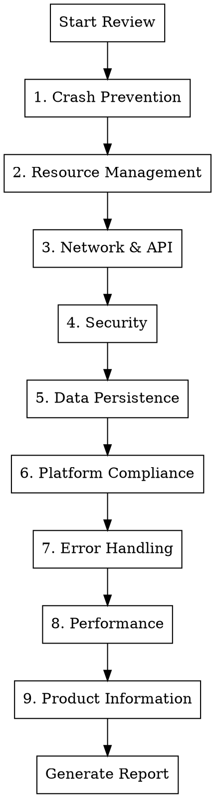

# App Store Readiness Code Review

## Overview

Systematic code review process for applications targeting Apple App Store, Google Play, or desktop distribution. Identifies crash risks, security vulnerabilities, resource leaks, and compliance issues that cause rejection or poor user experience.

This skill now includes a mandatory cross-repo consistency pass for macOS app websites + README licensing language before release.

## When to Use

- Before App Store/Play Store submission
- Before any production release
- When user says "ship", "release", "production ready", "App Store"
- After major feature completion
- When reviewing cross-platform apps (Flutter, React Native, etc.)

## Review Categories

Review ALL categories systematically. Do not skip any.



## Severity Classification

| Severity | Definition | Action |
|----------|------------|--------|
| **Critical** | Will cause crashes, data loss, or rejection | Must fix before submission |
| **High** | Likely to cause issues under normal use | Should fix before submission |
| **Medium** | Edge cases, degraded experience | Fix in next release |
| **Low** | Code quality, best practices | Nice to have |

## 1. Crash Prevention Checklist

### Flutter/Dart
- [ ] All async callbacks check `mounted` before `setState()`
- [ ] `StreamSubscription` cancelled in `dispose()`
- [ ] `Timer` cancelled in `dispose()`
- [ ] `AnimationController` disposed
- [ ] `TextEditingController` disposed
- [ ] `ScrollController` disposed
- [ ] `FocusNode` disposed
- [ ] Null safety: no force unwraps (`!`) without guaranteed non-null
- [ ] List/Map access with bounds checking or `.elementAtOrNull()`

### Flutter UI Patterns (Reference: flutter-python-fullstack)
- [ ] **Theme**: Uses `ColorScheme.fromSeed()` with Material 3
- [ ] **Dark mode**: Supports `ThemeMode.system` (respects OS preference)
- [ ] **Backend check**: Health check on startup with loading/disconnected states
- [ ] **Stats polling**: Uses `Future.doWhile()` with `mounted` guard
- [ ] **Status chips**: Color-coded (green/orange/red) using `withValues(alpha:)`
- [ ] **Deprecated APIs**: No `withOpacity()` (use `withValues(alpha:)` instead)
- [ ] **ApiService**: Centralized HTTP client with typed endpoints

### iOS/Swift
- [ ] No force unwraps (`!`) on optionals from external data
- [ ] `weak self` in closures to prevent retain cycles
- [ ] `deinit` called (add print to verify during testing)
- [ ] No unhandled `fatalError()` or `preconditionFailure()`

### Android/Kotlin
- [ ] Null checks on Intent extras
- [ ] Activity lifecycle handled (no operations on destroyed activity)
- [ ] Fragment lifecycle handled
- [ ] No `!!` on nullable external data

### Backend/Python
- [ ] All exceptions caught at API boundary
- [ ] No bare `except:` clauses (catch specific exceptions)
- [ ] Thread safety for shared resources
- [ ] Connection pool limits configured

## 2. Resource Management Checklist

### Memory Leaks
- [ ] Large objects released when not needed
- [ ] Image/media caching bounded
- [ ] Listeners/observers removed
- [ ] Background tasks cancelled on screen exit
- [ ] File handles closed in finally blocks
- [ ] Voice-clone pipelines profiled with Instruments (Allocations + Leaks) for full clone lifecycle (load model -> clone -> teardown)
- [ ] Add standalone clone regression tests using `Natasha` and `Suzan` voices to detect runaway memory growth or unreleased buffers

### File System
- [ ] Temp files cleaned up
- [ ] File existence checked before read
- [ ] File permissions checked
- [ ] Path sanitization (no `../` injection)
- [ ] Disk space checked before large writes

### Audio/Video
- [ ] Players disposed when done
- [ ] Audio session properly configured
- [ ] Background audio handled correctly
- [ ] Interruption handling (phone calls)

## 3. Network & API Checklist

### Timeouts
- [ ] All HTTP requests have timeout configured
- [ ] Reasonable timeout values (10-30s for normal, 60-120s for uploads)
- [ ] Timeout errors handled gracefully

### Error Handling
- [ ] Network unavailable handled
- [ ] Server errors (5xx) handled
- [ ] Client errors (4xx) handled with user feedback
- [ ] Malformed response handled
- [ ] Empty response handled

### Resilience
- [ ] Retry logic with exponential backoff
- [ ] Circuit breaker for failing services
- [ ] Offline mode / cached data fallback
- [ ] Request cancellation on screen exit

### Configuration
- [ ] Base URL configurable (not hardcoded localhost)
- [ ] API version handling
- [ ] Certificate pinning (if required)

## 4. Security Checklist

### Input Validation
- [ ] All user input validated
- [ ] Path traversal prevention (`../`)
- [ ] SQL injection prevention (parameterized queries)
- [ ] XSS prevention (output encoding)
- [ ] File type validation for uploads

### Authentication
- [ ] Tokens stored securely (Keychain/Keystore)
- [ ] Token refresh logic
- [ ] Session expiration handling
- [ ] Logout clears all sensitive data

### Network Security
- [ ] HTTPS only (no HTTP except localhost)
- [ ] CORS configured properly (not `*` in production)
- [ ] Sensitive data not logged
- [ ] API keys not in source code

### Data Protection
- [ ] Sensitive data encrypted at rest
- [ ] No sensitive data in logs
- [ ] No sensitive data in crash reports
- [ ] Clipboard cleared after paste of sensitive data

## 5. Data Persistence Checklist

### Database
- [ ] Schema migrations for updates
- [ ] Database connection pooling
- [ ] Thread-safe access (locking or connection per thread)
- [ ] Backup/restore capability
- [ ] Corruption recovery

### Preferences/Settings
- [ ] Default values for all settings
- [ ] Settings validation on load
- [ ] Settings migration for app updates

### Cache
- [ ] Cache size limits
- [ ] Cache expiration
- [ ] Cache invalidation logic
- [ ] Graceful handling of corrupted cache

## 6. Platform Compliance Checklist

### Apple App Store
- [ ] Privacy manifest (PrivacyInfo.xcprivacy) present
- [ ] Required device capabilities declared
- [ ] App Transport Security configured
- [ ] No private API usage
- [ ] Proper entitlements configured
- [ ] App icons all sizes present
- [ ] Launch screen configured

### Google Play
- [ ] Target SDK meets requirements
- [ ] Permissions declared and justified
- [ ] Data safety form ready
- [ ] 64-bit support
- [ ] App bundle (not APK)

### macOS App Store
- [ ] Sandboxing configured
- [ ] Hardened runtime enabled
- [ ] Notarization ready
- [ ] Entitlements minimal and justified

### macOS Distribution
- [ ] DMG builder script present (`scripts/build_dmg.sh`)
- [ ] DMG includes app bundle, Applications symlink, and background image
- [ ] Code signing for DMG distribution
- [ ] Notarization of DMG for Gatekeeper
- [ ] Volume name and window layout configured
- [ ] SHA256 hash generated alongside DMG (`.dmg.sha256`)
- [ ] Version extracted from centralized version file
- [ ] DMG root includes `LICENSE` (source) and `BINARY-LICENSE.txt` (binary/EULA)
- [ ] App bundle embeds `Contents/Resources/LICENSE` and `Contents/Resources/BINARY-LICENSE.txt`
- [ ] DMG license agreement configured (when supported by the DMG toolchain)

### Project Scripts (Reference: flutter-python-fullstack pattern)
- [ ] **Control script** (`bin/appctl`):
  - `appctl up` - Start all services
  - `appctl down` - Stop all services
  - `appctl status` - Show running/stopped with colors
  - `appctl logs` - Tail log files
  - `appctl clean` - Clean logs and temp files
- [ ] **Install script** (`install.sh`):
  - Check/install dependencies (Homebrew, Flutter, etc.)
  - Create virtual environments
  - Download required models
  - Colored output with status indicators
- [ ] **Diagnostic script** (`issues.sh`):
  - System info (OS, architecture, disk space)
  - Tool versions (Flutter, Python, git)
  - Port status checks
  - Network/health checks
  - Last 50 lines of runtime logs
  - Timestamped output file

### General
- [ ] Version number format correct
- [ ] Build number incremented
- [ ] Release notes prepared
- [ ] Screenshots current

## 7. Error Handling Checklist

### User Feedback
- [ ] All errors show user-friendly message
- [ ] Error messages actionable (what user can do)
- [ ] No technical jargon in user-facing errors
- [ ] Loading states for all async operations
- [ ] Empty states for lists

### Logging
- [ ] Errors logged with context
- [ ] No sensitive data in logs
- [ ] Log levels appropriate
- [ ] Crash reporting configured

### Recovery
- [ ] Retry option for transient failures
- [ ] Data preserved on error
- [ ] App state recoverable after crash
- [ ] Graceful degradation when features unavailable

## 8. Performance Checklist

### Startup
- [ ] Cold start < 3 seconds
- [ ] No blocking operations on main thread at startup
- [ ] Lazy loading for non-essential features

### UI Responsiveness
- [ ] No jank (dropped frames)
- [ ] Heavy work on background threads
- [ ] UI updates batched
- [ ] Large lists virtualized

### Memory
- [ ] Memory usage stable (no growth over time)
- [ ] Large assets loaded on demand
- [ ] Image resolution appropriate for display

### Battery
- [ ] Location updates minimal
- [ ] Background refresh minimal
- [ ] No unnecessary polling

## 9. Product Information Checklist

### Required App Information
- [ ] Version number displayed in app (Settings or About page)
- [ ] Build number accessible for support purposes
- [ ] Centralized version file pattern:
  ```dart
  // lib/version.dart
  const String appVersion = "2026.02.1";
  const int buildNumber = 1;
  const String versionName = "Initial Release";
  String get versionString => "$appVersion (build $buildNumber)";
  ```
- [ ] About page present and accessible from main navigation

### About Page Contents (Reference: MimikaStudio pattern)
- [ ] App logo/icon prominently displayed
- [ ] App name as headline
- [ ] Version number from centralized version file (e.g., `version.dart`)
- [ ] Version codename (optional, e.g., "Sunrise")
- [ ] Brief app description/tagline
- [ ] **Links section** with buttons for:
  - [ ] Website: https://qneura.ai/apps.html
  - [ ] GitHub repository (if open source)
  - [ ] Report Issue / Bug tracker
- [ ] License link (in-app License screen or repo license overview)
- [ ] **Credits/Powered By section** listing dependencies with clickable links
- [ ] **Footer** with:
  - [ ] License type (e.g., "Licensed under BSL-1.1")
  - [ ] Binary distribution restriction summary (if applicable)
  - [ ] Copyright: "© [YEAR] Qneura.ai"
  - [ ] Clickable Qneura.ai link to https://qneura.ai

### Legal Pages
- [ ] Privacy Policy page (required by App Store)
- [ ] Terms of Service / EULA page
- [ ] License overview page (source vs binary terms, plain English)
- [ ] Binary distribution license / EULA page (DMG/executable terms)
- [ ] Repo `LICENSE` file present and referenced in README
- [ ] All legal pages accessible from Settings or About

### License Integration (Source vs Binary)
- [ ] Create root `LICENSE` for source code (BSL-style, parameterized)
- [ ] Create root `BINARY-LICENSE.txt` (or `EULA-DMG.txt`) for DMG/executable
- [ ] Add `LICENSE.md` (or `docs/licensing.md`) explaining source vs binary terms
- [ ] Update README License section with links to `LICENSE`, `BINARY-LICENSE.txt`, and `LICENSE.md`
- [ ] UI integration: About footer mentions license + binary restriction; Legal section links to License page
- [ ] Terms of Service includes binary distribution restrictions and link to `BINARY-LICENSE.txt`
- [ ] Bundle both license files into the app (`Contents/Resources/`) and DMG root

### Cross-Repo Website + README Consistency (Mandatory)
- [ ] Use this canonical sentence (copy exactly, replace app name only):
  - `License: Source code is licensed under Business Source License 1.1 (BSL-1.1), and binary distributions are licensed under the [APP_NAME] Binary Distribution License. See LICENSE, BINARY-LICENSE.txt, and the website License page.`
- [ ] Place the canonical sentence in README near the top, immediately after the primary app-description paragraph.
- [ ] Keep the binary-availability sentence explicit in README and website CTA/meta:
  - `The codebase is cross-platform, but we currently provide macOS binaries only.`
- [ ] Link `we currently provide macOS binaries only.` in README top block to the app website home page.
- [ ] Link `Open Source` labels in website hero/meta rows to `license.html` (not plain text).
- [ ] In website hero badges/benefits, remove `Lifetime Updates` and avoid reintroducing it in future copy revisions.
- [ ] Add a primary `Download for macOS` CTA on the left hero column before `Get Started` / `View on GitHub` style links.
- [ ] Ensure each macOS app site under the web portfolio uses the same wording pattern (only app name varies).
- [ ] Verify `LICENSE`, `BINARY-LICENSE.txt`, and `license.html` all exist and are mutually consistent.
- [ ] In multi-repo web updates, stage and commit only intended files (usually `index.html`) when worktrees are already dirty.

### Contributor Identity Hygiene (Git)
- [ ] Audit contributors before release:
  - `git shortlog -sne --all`
  - `git log --all --format='%H%x09%an%x09%ae'`
  - scan commit bodies for `Co-authored-by`
- [ ] If alias/noise identities exist, add `.mailmap` canonical mappings to the project owner identity.
- [ ] Re-check shortlog after `.mailmap` update to confirm consolidation.
- [ ] Verify remote contributor view (`/contributors` API or GitHub UI) before attempting history rewrite.
- [ ] Do **not** rewrite published git history unless explicitly requested and approved by the user.

### Support & Contact
- [ ] Support email or contact form
- [ ] Help/FAQ section or link
- [ ] Bug report mechanism

### Accessibility
- [ ] VoiceOver/TalkBack support tested
- [ ] Dynamic font scaling supported
- [ ] Sufficient color contrast (WCAG AA)
- [ ] Touch targets minimum 44x44 points

### User Experience
- [ ] Onboarding/first-run experience for new users
- [ ] Update notification mechanism (in-app or store redirect)
- [ ] Data export capability (GDPR compliance)
- [ ] Account deletion option (if applicable)

### Settings Screen
- [ ] Output folder selection (with folder picker)
- [ ] Theme preference (Light/Dark/System)
- [ ] Clear cache option
- [ ] Reset to defaults option
- [ ] Backend connection status indicator
- [ ] Model/engine management (if applicable)

### Branding & Assets
- [ ] App icon at all required sizes
- [ ] Consistent branding throughout app
- [ ] Splash/launch screen matches branding

### App Store Metadata
- [ ] App description written
- [ ] Keywords optimized
- [ ] Screenshots current and accurate
- [ ] Preview video (optional but recommended)
- [ ] Category selected appropriately

## Legal Templates

Use these templates when creating legal pages for App Store submission. Replace bracketed placeholders.

### Terms of Service (Template - adapted from PageEcho)

```markdown
# Terms of Service

Last updated: [MONTH YYYY]

## 1. Acceptance of Terms

By accessing or using [APP_NAME] (the "Service"), you agree to be bound by these Terms of Service. If you do not agree to these terms, do not use the Service. Additional guidelines or rules may apply to specific features and are incorporated by reference.

## 2. Description of Service

[APP_NAME] is a [SHORT DESCRIPTION]. The Service allows users to [CORE FEATURES]. Some features may rely on on-device AI models and optional plugins.

## 3. User Conduct

You agree to use the Service only for lawful purposes and in compliance with applicable laws and regulations. You are prohibited from using the Service to impersonate others without consent, to create deceptive or harmful content, or to violate intellectual property rights.

## 4. Intellectual Property

The Service and its original content (excluding user-provided content) are the exclusive property of QNeura.ai and its licensors. You retain ownership of your content. Nothing in these terms grants you the right to use QNeura.ai trademarks or branding without permission.

## 5. AI Features Disclaimer

AI-generated outputs may be inaccurate, imperfect, or unsuitable for critical use cases. You should verify important information using original sources.

## 6. Disclaimer of Warranties

The Service is provided on an "AS IS" and "AS AVAILABLE" basis. QNeura.ai makes no warranties of any kind, express or implied, including but not limited to warranties of merchantability, fitness for a particular purpose, and noninfringement.

## 7. Limitation of Liability

In no event shall QNeura.ai be liable for any damages (including, without limitation, damages for loss of data or profit, or due to business interruption) arising out of the use or inability to use the Service.

## 8. Changes to Terms

QNeura.ai reserves the right, at its sole discretion, to modify or replace these Terms at any time. Continued use of the Service after changes constitutes acceptance of the updated terms.

## 9. Contact Us

If you have questions about these Terms, contact us at solomon@qneura.ai or https://qneura.ai/apps.html.

## 10. External Content Sources

The Service may provide access to or include third-party models, datasets, or libraries. These contents are provided by their respective sources and are subject to their own licenses. You are responsible for ensuring your use complies with applicable laws and third-party terms.

## 11. Apple Standard EULA

If the app is distributed through the Apple App Store, the Apple Standard EULA applies: https://www.apple.com/legal/internet-services/itunes/dev/stdeula/.

## 12. Paid Features

If paid features are offered, purchases are processed by the storefront or payment provider and are governed by their terms. Subscription management and cancellations are handled through your account with that provider.
```

### Privacy Policy (Template)

```markdown
# Privacy Policy

Last updated: [MONTH YYYY]

## 1. Introduction

[APP_NAME] ("we," "our," or "us") respects your privacy and is committed to protecting it. This Privacy Policy explains how we handle information when you use the app.

## 2. Information Collection

The app is designed to be local-first. We do not collect personal information by default. We do not track usage behavior or sell data to third parties. Your content remains on your device unless you choose to share it.

## 3. On-Device Processing

AI features run locally using on-device models. Your content is processed entirely on your device and is not sent to external servers for processing.

## 4. Data Storage

Files you import or generate are stored locally in locations you select. You control when and how to delete or share this data.

## 5. Third-Party Services

The app may utilize system-level services provided by your operating system. Optional update or license checks may transmit basic app and device metadata (such as version and OS information), but no user content is transmitted. If third-party services are enabled in future releases, this policy will be updated accordingly.

## 6. Data Security

Since data stays on your device, its security depends on your device security settings. We recommend using passcodes or biometrics where available.

## 7. Children's Privacy

The Service does not address anyone under the age of 13. We do not knowingly collect personal information from children under 13.

## 8. Changes to This Privacy Policy

We may update this Privacy Policy from time to time. We will notify you of any changes by posting the new policy and updating the "Last updated" date.

## 9. Contact Us

If you have any questions about this Privacy Policy, contact us at solomon@qneura.ai or https://qneura.ai/apps.html.
```

### Business Source License 1.1 (Template)

```text
Business Source License 1.1

Parameters
Licensor: [COMPANY_NAME]
Licensed Work: [APP_NAME] Source Code
Additional Use Grant: [Production use allowed / see BINARY-LICENSE.txt for binary terms]
Change Date: [YYYY-MM-DD]
Change License: [GPL-2.0-or-later or compatible license]

Terms

The Licensor hereby grants you the right to copy, modify, create derivative
works, redistribute, and make non-production use of the Licensed Work. The
Licensor may make an Additional Use Grant, above, permitting limited
production use.

Effective on the Change Date, or the fourth anniversary of the first publicly
available distribution of a specific version of the Licensed Work under this
License, whichever comes first, the Licensor hereby grants you rights under
the terms of the Change License, and the rights granted in the paragraph
above terminate.

If your use of the Licensed Work does not comply with the requirements
currently in effect as described in this License, you must purchase a
commercial license from the Licensor, its affiliated entities, or authorized
resellers, or you must refrain from using the Licensed Work.

All copies of the original and modified Licensed Work, and derivative works
of the Licensed Work, are subject to this License. This License applies
separately for each version of the Licensed Work and the Change Date may vary
for each version of the Licensed Work released by Licensor.

You must conspicuously display this License on each original or modified copy
of the Licensed Work. If you receive the Licensed Work in original or
modified form from a third party, the terms and conditions set forth in this
License apply to your use of that work.

Any use of the Licensed Work in violation of this License will automatically
terminate your rights under this License for the current and all other
versions of the Licensed Work.

This License does not grant you any right in any trademark or logo of
Licensor or its affiliates (provided that you may use a trademark or logo of
Licensor as expressly required by this License).

TO THE EXTENT PERMITTED BY APPLICABLE LAW, THE LICENSED WORK IS PROVIDED ON
AN "AS IS" BASIS. LICENSOR HEREBY DISCLAIMS ALL WARRANTIES AND CONDITIONS,
EXPRESS OR IMPLIED, INCLUDING (WITHOUT LIMITATION) WARRANTIES OF
MERCHANTABILITY, FITNESS FOR A PARTICULAR PURPOSE, NON-INFRINGEMENT, AND
TITLE.

MariaDB hereby grants you permission to use this License's text to license
your works, and to refer to it using the trademark "Business Source License",
as long as you comply with the Covenants of Licensor below.

Covenants of Licensor

In consideration of the right to use this License's text and the "Business
Source License" name and trademark, Licensor covenants to MariaDB, and to all
other recipients of the licensed work to be provided by Licensor:

1. To specify as the Change License the GPL Version 2.0 or any later version,
   or a license that is compatible with GPL Version 2.0 or a later version,
   where "compatible" means that software provided under the Change License can
   be included in a program with software provided under GPL Version 2.0 or a
   later version. Licensor may specify additional Change Licenses without
   limitation.

2. To either: (a) specify an additional grant of rights to use that does not
   impose any additional restriction on the right granted in this License, as
   the Additional Use Grant; or (b) insert the text "None".

3. To specify a Change Date.

4. Not to modify this License in any other way.
```

### Binary Distribution License (Template)

```text
Binary Distribution License

This Binary Distribution License ("License") governs use of the compiled
binary distribution for [APP_NAME] (the "Binary"), including DMG, EXE, and
app bundles.

1. License Grant
You may install and use the Binary for personal or internal business use.

2. Restrictions
You may not sell, rent, sublicense, or redistribute the Binary.
You may not use the Binary for any commercial offering or for third-party
hosting/managed service.

3. Source Code
Source code is licensed separately under the Business Source License 1.1.
See [SOURCE_LICENSE_FILE] for details.

4. No Warranty
THE BINARY IS PROVIDED "AS IS", WITHOUT WARRANTY OF ANY KIND, EXPRESS OR
IMPLIED, INCLUDING BUT NOT LIMITED TO WARRANTIES OF MERCHANTABILITY,
FITNESS FOR A PARTICULAR PURPOSE, AND NON-INFRINGEMENT.

5. Limitation of Liability
IN NO EVENT SHALL [COMPANY_NAME] BE LIABLE FOR ANY CLAIM, DAMAGES, OR OTHER
LIABILITY ARISING FROM THE USE OF THE BINARY.

6. Contact
If you need commercial binary distribution rights, contact [CONTACT_EMAIL].
```

### License Overview Page (Template)

```markdown
# Licensing Overview

Last updated: [MONTH YYYY]

## Summary
[APP_NAME] is source-available under a BSL-style license. Source code use is
allowed, while binary distribution has stricter terms.

## Source Code License (BSL 1.1)
- **License:** Business Source License 1.1
- **Scope:** Source code only
- **File:** `LICENSE`
- **Notes:** [Short description of permitted use and change date]

## Binary Distribution License
- **License:** Binary Distribution License (EULA)
- **Scope:** DMG/EXE/app bundles and any compiled binaries
- **File:** `BINARY-LICENSE.txt`
- **Key restriction:** No commercial use or redistribution of the Binary

## What You Can Do
- Clone and modify the source code
- Build binaries for personal or internal use
- Use the source code in production (as permitted by BSL parameters)

## What You Cannot Do
- Sell or redistribute the official binary distribution
- Offer the binary as part of a commercial service without a license

## Need Commercial Rights?
Contact [CONTACT_EMAIL] for commercial binary licensing.
```

### README License Section (Template)

```markdown
## License

- Source code: Business Source License 1.1 (`LICENSE`)
- Binary distribution: Binary Distribution License (`BINARY-LICENSE.txt`)
- Overview: `LICENSE.md`
```

## Report Format

Generate report with this structure:

```markdown
# Code Review Report - App Store Readiness

## Executive Summary
- Total issues: X (Critical: N, High: N, Medium: N, Low: N)
- Recommendation: [Ready / Needs Work / Not Ready]

## Critical Issues (Must Fix)
### Issue 1.1: [Title]
**File:** path/to/file.dart
**Lines:** XX-YY
**Severity:** Critical
**Description:** What's wrong
**Current Code:** `code snippet`
**Recommended Fix:** `fixed code`

## High Issues (Should Fix)
[Same format]

## Medium Issues (Address Soon)
[Same format]

## Low Issues (Nice to Have)
[Same format]

## Positive Observations
[What's done well]

## Recommendations
[Prioritized action items]
```

## Common Issues by Framework

### Flutter
| Issue | Pattern | Fix |
|-------|---------|-----|
| Timer leak | `Timer.periodic` without cancel | Cancel in `dispose()` |
| Stream leak | `.listen()` without cancel | Store subscription, cancel in `dispose()` |
| setState after dispose | Async callback calls setState | Check `mounted` first |
| Hardcoded strings | `'http://localhost'` | Use environment config |

### FastAPI/Python
| Issue | Pattern | Fix |
|-------|---------|-----|
| CORS open | `allow_origins=["*"]` | Whitelist specific origins |
| No timeout | Default connection timeout | Set explicit timeouts |
| Thread unsafe DB | `check_same_thread=False` | Add connection locking |
| Swallowed exceptions | `except: pass` | Log or handle specifically |

### iOS/Swift
| Issue | Pattern | Fix |
|-------|---------|-----|
| Retain cycle | `self` in closure | Use `[weak self]` |
| Force unwrap | `value!` | Use `guard let` or `if let` |
| Main thread UI | Background queue UI update | `DispatchQueue.main.async` |

### Product Information
| Issue | Pattern | Fix |
|-------|---------|-----|
| Missing version | No version display | Add to About/Settings page |
| Missing privacy | No privacy policy | Add in-app privacy page + App Store link |
| Wrong author | Generic or missing author | Set to Qneura.ai with link |
| No legal pages | Missing ToS/License | Add accessible legal section |
| No accessibility | VoiceOver not tested | Test with screen reader, fix labels |

### Project Infrastructure
| Issue | Pattern | Fix |
|-------|---------|-----|
| No control script | Manual process start/stop | Add `bin/appctl` with up/down/status |
| No installer | Complex setup steps | Add `install.sh` with dependency checks |
| No diagnostics | Hard to debug issues | Add `issues.sh` with system info + logs |
| No DMG script | Manual DMG creation | Add `scripts/build_dmg.sh` |
| Deprecated Flutter API | `withOpacity()` usage | Replace with `withValues(alpha:)` |
| No dark mode | Only light theme | Add `ThemeMode.system` support |

## Quick Commands

After review, offer to fix issues:
1. "Fix all Critical issues" - Implement fixes for severity=Critical
2. "Fix Critical + High" - Implement fixes for Critical and High
3. "Generate fix plan" - Create detailed implementation plan

## Red Flags - Immediate Attention

- `localhost` or `127.0.0.1` hardcoded (except for bundled backend)
- `allow_origins=["*"]` in CORS
- `check_same_thread=False` without locking
- Force unwraps on external data (`!` in Dart, `!!` in Kotlin, `!` in Swift)
- No timeout on network requests
- `Timer.periodic` without corresponding cancel
- `setState` without `mounted` check in async
- Bare `except:` or `catch (e) {}` that swallows errors
- Passwords/API keys in source code
- No input validation on file paths
- Missing About page or version display
- No privacy policy in app
- Missing `LICENSE` or `BINARY-LICENSE.txt`
- Author not set to Qneura.ai
- No accessibility testing done
- No `bin/appctl` control script
- No `install.sh` installer script
- No `issues.sh` diagnostic script
- Using deprecated `withOpacity()` instead of `withValues(alpha:)`
- No dark mode support
