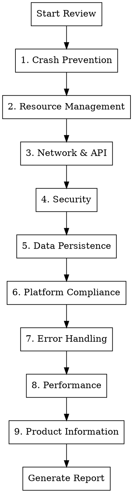

# App Store Readiness Code Review

## Overview

Systematic code review process for applications targeting Apple App Store, Google Play, or desktop distribution. Identifies crash risks, security vulnerabilities, resource leaks, and compliance issues that cause rejection or poor user experience.

## When to Use

- Before App Store/Play Store submission
- Before any production release
- When user says "ship", "release", "production ready", "App Store"
- After major feature completion
- When reviewing cross-platform apps (Flutter, React Native, etc.)

## Review Categories

Review ALL categories systematically. Do not skip any.



## Severity Classification

| Severity | Definition | Action |
|----------|------------|--------|
| **Critical** | Will cause crashes, data loss, or rejection | Must fix before submission |
| **High** | Likely to cause issues under normal use | Should fix before submission |
| **Medium** | Edge cases, degraded experience | Fix in next release |
| **Low** | Code quality, best practices | Nice to have |

## 1. Crash Prevention Checklist

### Flutter/Dart
- [ ] All async callbacks check `mounted` before `setState()`
- [ ] `StreamSubscription` cancelled in `dispose()`
- [ ] `Timer` cancelled in `dispose()`
- [ ] `AnimationController` disposed
- [ ] `TextEditingController` disposed
- [ ] `ScrollController` disposed
- [ ] `FocusNode` disposed
- [ ] Null safety: no force unwraps (`!`) without guaranteed non-null
- [ ] List/Map access with bounds checking or `.elementAtOrNull()`

### Flutter UI Patterns (Reference: flutter-python-fullstack)
- [ ] **Theme**: Uses `ColorScheme.fromSeed()` with Material 3
- [ ] **Dark mode**: Supports `ThemeMode.system` (respects OS preference)
- [ ] **Backend check**: Health check on startup with loading/disconnected states
- [ ] **Stats polling**: Uses `Future.doWhile()` with `mounted` guard
- [ ] **Status chips**: Color-coded (green/orange/red) using `withValues(alpha:)`
- [ ] **Deprecated APIs**: No `withOpacity()` (use `withValues(alpha:)` instead)
- [ ] **ApiService**: Centralized HTTP client with typed endpoints

### iOS/Swift
- [ ] No force unwraps (`!`) on optionals from external data
- [ ] `weak self` in closures to prevent retain cycles
- [ ] `deinit` called (add print to verify during testing)
- [ ] No unhandled `fatalError()` or `preconditionFailure()`

### Android/Kotlin
- [ ] Null checks on Intent extras
- [ ] Activity lifecycle handled (no operations on destroyed activity)
- [ ] Fragment lifecycle handled
- [ ] No `!!` on nullable external data

### Backend/Python
- [ ] All exceptions caught at API boundary
- [ ] No bare `except:` clauses (catch specific exceptions)
- [ ] Thread safety for shared resources
- [ ] Connection pool limits configured

## 2. Resource Management Checklist

### Memory Leaks
- [ ] Large objects released when not needed
- [ ] Image/media caching bounded
- [ ] Listeners/observers removed
- [ ] Background tasks cancelled on screen exit
- [ ] File handles closed in finally blocks

### File System
- [ ] Temp files cleaned up
- [ ] File existence checked before read
- [ ] File permissions checked
- [ ] Path sanitization (no `../` injection)
- [ ] Disk space checked before large writes

### Audio/Video
- [ ] Players disposed when done
- [ ] Audio session properly configured
- [ ] Background audio handled correctly
- [ ] Interruption handling (phone calls)

## 3. Network & API Checklist

### Timeouts
- [ ] All HTTP requests have timeout configured
- [ ] Reasonable timeout values (10-30s for normal, 60-120s for uploads)
- [ ] Timeout errors handled gracefully

### Error Handling
- [ ] Network unavailable handled
- [ ] Server errors (5xx) handled
- [ ] Client errors (4xx) handled with user feedback
- [ ] Malformed response handled
- [ ] Empty response handled

### Resilience
- [ ] Retry logic with exponential backoff
- [ ] Circuit breaker for failing services
- [ ] Offline mode / cached data fallback
- [ ] Request cancellation on screen exit

### Configuration
- [ ] Base URL configurable (not hardcoded localhost)
- [ ] API version handling
- [ ] Certificate pinning (if required)

## 4. Security Checklist

### Input Validation
- [ ] All user input validated
- [ ] Path traversal prevention (`../`)
- [ ] SQL injection prevention (parameterized queries)
- [ ] XSS prevention (output encoding)
- [ ] File type validation for uploads

### Authentication
- [ ] Tokens stored securely (Keychain/Keystore)
- [ ] Token refresh logic
- [ ] Session expiration handling
- [ ] Logout clears all sensitive data

### Network Security
- [ ] HTTPS only (no HTTP except localhost)
- [ ] CORS configured properly (not `*` in production)
- [ ] Sensitive data not logged
- [ ] API keys not in source code

### Data Protection
- [ ] Sensitive data encrypted at rest
- [ ] No sensitive data in logs
- [ ] No sensitive data in crash reports
- [ ] Clipboard cleared after paste of sensitive data

## 5. Data Persistence Checklist

### Database
- [ ] Schema migrations for updates
- [ ] Database connection pooling
- [ ] Thread-safe access (locking or connection per thread)
- [ ] Backup/restore capability
- [ ] Corruption recovery

### Preferences/Settings
- [ ] Default values for all settings
- [ ] Settings validation on load
- [ ] Settings migration for app updates

### Cache
- [ ] Cache size limits
- [ ] Cache expiration
- [ ] Cache invalidation logic
- [ ] Graceful handling of corrupted cache

## 6. Platform Compliance Checklist

### Apple App Store
- [ ] Privacy manifest (PrivacyInfo.xcprivacy) present
- [ ] Required device capabilities declared
- [ ] App Transport Security configured
- [ ] No private API usage
- [ ] Proper entitlements configured
- [ ] App icons all sizes present
- [ ] Launch screen configured

### Google Play
- [ ] Target SDK meets requirements
- [ ] Permissions declared and justified
- [ ] Data safety form ready
- [ ] 64-bit support
- [ ] App bundle (not APK)

### macOS App Store
- [ ] Sandboxing configured
- [ ] Hardened runtime enabled
- [ ] Notarization ready
- [ ] Entitlements minimal and justified

### macOS Distribution
- [ ] DMG builder script present (`scripts/build_dmg.sh`)
- [ ] DMG includes app bundle, Applications symlink, and background image
- [ ] Code signing for DMG distribution
- [ ] Notarization of DMG for Gatekeeper
- [ ] Volume name and window layout configured
- [ ] SHA256 hash generated alongside DMG (`.dmg.sha256`)
- [ ] Version extracted from centralized version file

### Project Scripts (Reference: flutter-python-fullstack pattern)
- [ ] **Control script** (`bin/appctl`):
  - `appctl up` - Start all services
  - `appctl down` - Stop all services
  - `appctl status` - Show running/stopped with colors
  - `appctl logs` - Tail log files
  - `appctl clean` - Clean logs and temp files
- [ ] **Install script** (`install.sh`):
  - Check/install dependencies (Homebrew, Flutter, etc.)
  - Create virtual environments
  - Download required models
  - Colored output with status indicators
- [ ] **Diagnostic script** (`issues.sh`):
  - System info (OS, architecture, disk space)
  - Tool versions (Flutter, Python, git)
  - Port status checks
  - Network/health checks
  - Last 50 lines of runtime logs
  - Timestamped output file

### General
- [ ] Version number format correct
- [ ] Build number incremented
- [ ] Release notes prepared
- [ ] Screenshots current

## 7. Error Handling Checklist

### User Feedback
- [ ] All errors show user-friendly message
- [ ] Error messages actionable (what user can do)
- [ ] No technical jargon in user-facing errors
- [ ] Loading states for all async operations
- [ ] Empty states for lists

### Logging
- [ ] Errors logged with context
- [ ] No sensitive data in logs
- [ ] Log levels appropriate
- [ ] Crash reporting configured

### Recovery
- [ ] Retry option for transient failures
- [ ] Data preserved on error
- [ ] App state recoverable after crash
- [ ] Graceful degradation when features unavailable

## 8. Performance Checklist

### Startup
- [ ] Cold start < 3 seconds
- [ ] No blocking operations on main thread at startup
- [ ] Lazy loading for non-essential features

### UI Responsiveness
- [ ] No jank (dropped frames)
- [ ] Heavy work on background threads
- [ ] UI updates batched
- [ ] Large lists virtualized

### Memory
- [ ] Memory usage stable (no growth over time)
- [ ] Large assets loaded on demand
- [ ] Image resolution appropriate for display

### Battery
- [ ] Location updates minimal
- [ ] Background refresh minimal
- [ ] No unnecessary polling

## 9. Product Information Checklist

### Required App Information
- [ ] Version number displayed in app (Settings or About page)
- [ ] Build number accessible for support purposes
- [ ] Centralized version file pattern:
  ```dart
  // lib/version.dart
  const String appVersion = "2026.02.1";
  const int buildNumber = 1;
  const String versionName = "Initial Release";
  String get versionString => "$appVersion (build $buildNumber)";
  ```
- [ ] About page present and accessible from main navigation

### About Page Contents (Reference: MimikaStudio pattern)
- [ ] App logo/icon prominently displayed
- [ ] App name as headline
- [ ] Version number from centralized version file (e.g., `version.dart`)
- [ ] Version codename (optional, e.g., "Sunrise")
- [ ] Brief app description/tagline
- [ ] **Links section** with buttons for:
  - [ ] Website: https://qneura.ai/apps.html
  - [ ] GitHub repository (if open source)
  - [ ] Report Issue / Bug tracker
- [ ] **Credits/Powered By section** listing dependencies with clickable links
- [ ] **Footer** with:
  - [ ] License type (e.g., "Licensed under GPL v3.0")
  - [ ] Copyright: "© [YEAR] Qneura.ai"
  - [ ] Clickable Qneura.ai link to https://qneura.ai

### Legal Pages
- [ ] Privacy Policy page (required by App Store)
- [ ] Terms of Service / EULA page
- [ ] License page (open source attributions if applicable)
- [ ] All legal pages accessible from Settings or About

### Support & Contact
- [ ] Support email or contact form
- [ ] Help/FAQ section or link
- [ ] Bug report mechanism

### Accessibility
- [ ] VoiceOver/TalkBack support tested
- [ ] Dynamic font scaling supported
- [ ] Sufficient color contrast (WCAG AA)
- [ ] Touch targets minimum 44x44 points

### User Experience
- [ ] Onboarding/first-run experience for new users
- [ ] Update notification mechanism (in-app or store redirect)
- [ ] Data export capability (GDPR compliance)
- [ ] Account deletion option (if applicable)

### Settings Screen
- [ ] Output folder selection (with folder picker)
- [ ] Theme preference (Light/Dark/System)
- [ ] Clear cache option
- [ ] Reset to defaults option
- [ ] Backend connection status indicator
- [ ] Model/engine management (if applicable)

### Branding & Assets
- [ ] App icon at all required sizes
- [ ] Consistent branding throughout app
- [ ] Splash/launch screen matches branding

### App Store Metadata
- [ ] App description written
- [ ] Keywords optimized
- [ ] Screenshots current and accurate
- [ ] Preview video (optional but recommended)
- [ ] Category selected appropriately

## Report Format

Generate report with this structure:

```markdown
# Code Review Report - App Store Readiness

## Executive Summary
- Total issues: X (Critical: N, High: N, Medium: N, Low: N)
- Recommendation: [Ready / Needs Work / Not Ready]

## Critical Issues (Must Fix)
### Issue 1.1: [Title]
**File:** path/to/file.dart
**Lines:** XX-YY
**Severity:** Critical
**Description:** What's wrong
**Current Code:** `code snippet`
**Recommended Fix:** `fixed code`

## High Issues (Should Fix)
[Same format]

## Medium Issues (Address Soon)
[Same format]

## Low Issues (Nice to Have)
[Same format]

## Positive Observations
[What's done well]

## Recommendations
[Prioritized action items]
```

## Common Issues by Framework

### Flutter
| Issue | Pattern | Fix |
|-------|---------|-----|
| Timer leak | `Timer.periodic` without cancel | Cancel in `dispose()` |
| Stream leak | `.listen()` without cancel | Store subscription, cancel in `dispose()` |
| setState after dispose | Async callback calls setState | Check `mounted` first |
| Hardcoded strings | `'http://localhost'` | Use environment config |

### FastAPI/Python
| Issue | Pattern | Fix |
|-------|---------|-----|
| CORS open | `allow_origins=["*"]` | Whitelist specific origins |
| No timeout | Default connection timeout | Set explicit timeouts |
| Thread unsafe DB | `check_same_thread=False` | Add connection locking |
| Swallowed exceptions | `except: pass` | Log or handle specifically |

### iOS/Swift
| Issue | Pattern | Fix |
|-------|---------|-----|
| Retain cycle | `self` in closure | Use `[weak self]` |
| Force unwrap | `value!` | Use `guard let` or `if let` |
| Main thread UI | Background queue UI update | `DispatchQueue.main.async` |

### Product Information
| Issue | Pattern | Fix |
|-------|---------|-----|
| Missing version | No version display | Add to About/Settings page |
| Missing privacy | No privacy policy | Add in-app privacy page + App Store link |
| Wrong author | Generic or missing author | Set to Qneura.ai with link |
| No legal pages | Missing ToS/License | Add accessible legal section |
| No accessibility | VoiceOver not tested | Test with screen reader, fix labels |

### Project Infrastructure
| Issue | Pattern | Fix |
|-------|---------|-----|
| No control script | Manual process start/stop | Add `bin/appctl` with up/down/status |
| No installer | Complex setup steps | Add `install.sh` with dependency checks |
| No diagnostics | Hard to debug issues | Add `issues.sh` with system info + logs |
| No DMG script | Manual DMG creation | Add `scripts/build_dmg.sh` |
| Deprecated Flutter API | `withOpacity()` usage | Replace with `withValues(alpha:)` |
| No dark mode | Only light theme | Add `ThemeMode.system` support |

## Quick Commands

After review, offer to fix issues:
1. "Fix all Critical issues" - Implement fixes for severity=Critical
2. "Fix Critical + High" - Implement fixes for Critical and High
3. "Generate fix plan" - Create detailed implementation plan

## Red Flags - Immediate Attention

- `localhost` or `127.0.0.1` hardcoded (except for bundled backend)
- `allow_origins=["*"]` in CORS
- `check_same_thread=False` without locking
- Force unwraps on external data (`!` in Dart, `!!` in Kotlin, `!` in Swift)
- No timeout on network requests
- `Timer.periodic` without corresponding cancel
- `setState` without `mounted` check in async
- Bare `except:` or `catch (e) {}` that swallows errors
- Passwords/API keys in source code
- No input validation on file paths
- Missing About page or version display
- No privacy policy in app
- Author not set to Qneura.ai
- No accessibility testing done
- No `bin/appctl` control script
- No `install.sh` installer script
- No `issues.sh` diagnostic script
- Using deprecated `withOpacity()` instead of `withValues(alpha:)`
- No dark mode support
