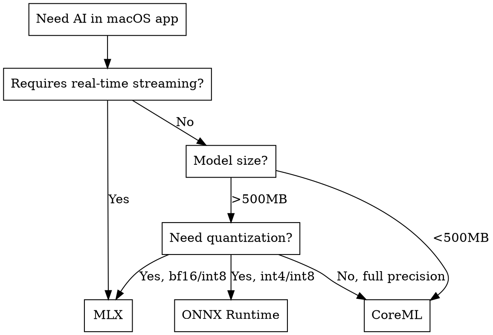

# Native AI Model Selection for macOS Apps

## Overview

This skill guides selection of native (non-Python) AI models for macOS applications. Native models run directly on Apple Silicon via ONNX Runtime, Core ML, MLX, or Metal compute shaders, eliminating Python runtime dependencies and enabling true desktop app distribution.

## When to Use

- Choosing AI models for a new macOS app feature
- Migrating from Python-based ML to native execution
- Optimizing for Apple Silicon (M1/M2/M3/M4)
- Building DMG-distributable apps with embedded AI
- Selecting between ONNX, CoreML, and MLX frameworks

## Framework Decision Matrix



### Framework Comparison

| Framework | Best For | Apple Silicon | Quantization | Bundle Size | Streaming |
|-----------|----------|---------------|--------------|-------------|-----------|
| **MLX** | LLMs, TTS, real-time | Excellent (Metal) | bf16, int8, int4 | Medium | Yes |
| **Core ML** | Embeddings, classification | Excellent (ANE) | float16 | Small | Limited |
| **ONNX Runtime** | Cross-platform, TTS | Good (CoreML EP) | int4, int8, fp16 | Large | Yes |
| **Metal Shaders** | Custom ops, vector search | Native | Manual | Minimal | Yes |

## Model Selection by Use Case

### 1. Text-to-Speech (TTS)

#### Recommended Models

| Model | Framework | Languages | Voice Cloning | Quality | Speed | Size |
|-------|-----------|-----------|---------------|---------|-------|------|
| **Qwen3-TTS** | MLX | 10 (EN, ZH, JA, KO, DE, FR, RU, PT, ES, IT) | Yes | Excellent | Fast | 0.6B-1.7B |
| **Kokoro** | ONNX/MLX | English (British) | No | Good | Very Fast | 82M |
| **Chatterbox** | ONNX/MLX | Multilingual | Yes | Excellent | Medium | 2GB |

#### Selection Criteria

```
IF need voice cloning:
    → Qwen3-TTS (MLX) or Chatterbox (ONNX/MLX)

IF need fastest inference:
    → Kokoro (82M params, sub-100ms latency)

IF need multilingual:
    → Qwen3-TTS (10 languages) or Chatterbox

IF need smallest bundle:
    → Kokoro ONNX (~325MB) or Kokoro MLX (~300MB)

IF need streaming audio:
    → Qwen3-TTS with MLX (native streaming support)
```

#### Integration Pattern (MLX TTS)

```swift
// Qwen3-TTS via MLX Swift
import Qwen3TTS

let tts = try await Qwen3TTS.loadModel(
    variant: .base_0_6B,  // or .customVoice_1_7B
    quantization: .bf16
)

// Generate speech
let audio = try await tts.synthesize(
    text: "Hello world",
    speaker: .ryan,  // CustomVoice mode
    language: .english
)

// Stream audio chunks
for try await chunk in tts.streamSynthesize(text: longText) {
    audioPlayer.enqueue(chunk)
}
```

#### Integration Pattern (ONNX TTS)

```swift
// Kokoro via ONNX Runtime
import OnnxRuntime

let session = try ORTSession(
    modelPath: Bundle.main.path(forResource: "kokoro-v1.0", ofType: "onnx")!
)

let inputs: [String: ORTValue] = [
    "text": textTokens,
    "voice": voiceEmbedding
]
let outputs = try session.run(inputs: inputs)
let audio = outputs["audio"]?.floatArray
```

### 2. Speech-to-Text (STT)

#### Recommended Models

| Model | Framework | Languages | Real-time | Accuracy | Size |
|-------|-----------|-----------|-----------|----------|------|
| **Whisper** | MLX | 99+ | Yes | Excellent | 39M-1.5B |
| **Whisper** | CoreML | 99+ | Limited | Excellent | 39M-1.5B |
| **Dicta** | ONNX | Specialized | Yes | Good | ~100MB |

#### Selection Criteria

```
IF need real-time transcription:
    → Whisper via MLX (streaming VAD support)

IF need offline-first with ANE:
    → Whisper via CoreML (compile with coremltools)

IF need specialized domain:
    → Fine-tuned Whisper or domain-specific model

IF need smallest footprint:
    → Whisper Tiny (39M) or Whisper Base (74M)
```

#### Integration Pattern (MLX Whisper)

```swift
// Whisper via MLX-Audio
import MLXAudio

let whisper = try await Whisper.loadModel(size: .base)

// Transcribe file
let result = try await whisper.transcribe(audioURL: fileURL)
print(result.text)

// Real-time transcription
let stream = whisper.streamTranscribe(audioStream: microphoneStream)
for try await segment in stream {
    updateUI(segment.text)
}
```

### 3. Semantic Search / Text Embeddings

#### Recommended Models

| Model | Framework | Dimensions | Speed | Quality | Size |
|-------|-----------|------------|-------|---------|------|
| **all-MiniLM-L6-v2** | CoreML | 384 | Very Fast | Good | ~90MB |
| **all-mpnet-base-v2** | CoreML | 768 | Fast | Better | ~420MB |
| **E5-small** | MLX/ONNX | 384 | Fast | Good | ~130MB |
| **BGE-small** | MLX/ONNX | 384 | Fast | Better | ~130MB |

#### Selection Criteria

```
IF need fastest embeddings (real-time search):
    → all-MiniLM-L6-v2 via CoreML (ANE optimized)

IF need highest quality:
    → all-mpnet-base-v2 or BGE-base

IF need multilingual:
    → multilingual-e5-small or paraphrase-multilingual-MiniLM

IF embedding + reranking:
    → BGE family (embeddings) + BGE-reranker
```

#### Integration Pattern (CoreML Embeddings)

```swift
// MiniLM via CoreML (Wax framework pattern)
import CoreML

class MiniLMEmbeddings {
    private let model: all_MiniLM_L6_v2
    private let tokenizer: BertTokenizer

    func embed(text: String) throws -> [Float] {
        let tokens = tokenizer.tokenize(text, maxLength: 512)
        let input = all_MiniLM_L6_v2Input(
            input_ids: tokens.inputIds,
            attention_mask: tokens.attentionMask
        )
        let output = try model.prediction(input: input)
        return output.embeddings.toFloatArray()
    }
}
```

#### Vector Search with Metal

```swift
// Cosine similarity via Metal compute shader
import Metal

let cosineKernel = library.makeFunction(name: "cosine_distance")!
let pipeline = try device.makeComputePipelineState(function: cosineKernel)

// Batch similarity search
commandEncoder.setComputePipelineState(pipeline)
commandEncoder.setBuffer(queryEmbedding, offset: 0, index: 0)
commandEncoder.setBuffer(documentEmbeddings, offset: 0, index: 1)
commandEncoder.setBuffer(resultsBuffer, offset: 0, index: 2)
commandEncoder.dispatchThreadgroups(threadgroupsPerGrid, threadsPerThreadgroup: threadsPerGroup)
```

### 4. Lexical Search / Keyword Indexing

#### Recommended Approaches

| Approach | Framework | Best For | Integration |
|----------|-----------|----------|-------------|
| **SQLite FTS5** | Native | Full-text search | Built-in |
| **Tantivy** | Rust/Swift | Large corpora | FFI bridge |
| **Search Kit** | Native macOS | Document indexing | Framework |

#### Selection Criteria

```
IF simple full-text search:
    → SQLite FTS5 (zero dependencies, built into macOS)

IF need advanced ranking (BM25, TF-IDF):
    → Tantivy via Swift FFI or SQLite FTS5 with BM25

IF indexing files/documents:
    → macOS Search Kit (Spotlight-compatible)

IF hybrid search (lexical + semantic):
    → SQLite FTS5 + MiniLM embeddings + reciprocal rank fusion
```

#### Integration Pattern (SQLite FTS5)

```swift
// Full-text search with SQLite FTS5
import SQLite3

// Create FTS table
sqlite3_exec(db, """
    CREATE VIRTUAL TABLE documents_fts USING fts5(
        title, content,
        tokenize='porter unicode61'
    );
""", nil, nil, nil)

// Search with BM25 ranking
let query = "SELECT *, bm25(documents_fts) as rank FROM documents_fts WHERE documents_fts MATCH ? ORDER BY rank"
```

### 5. RAG (Retrieval-Augmented Generation)

#### Architecture Pattern

```
┌─────────────────────────────────────────────────────────────┐
│                      RAG Pipeline                            │
├─────────────────────────────────────────────────────────────┤
│  1. Indexing                                                 │
│     ├── Text Chunking (512-1024 tokens)                     │
│     ├── Embedding (MiniLM/E5 via CoreML)                    │
│     └── Vector Store (SQLite + BLOB or FAISS)              │
│                                                              │
│  2. Retrieval                                                │
│     ├── Query Embedding (same model as indexing)            │
│     ├── Vector Search (Metal cosine similarity)             │
│     ├── Optional: Lexical Search (FTS5)                     │
│     └── Reranking (BGE-reranker or cross-encoder)          │
│                                                              │
│  3. Generation                                               │
│     ├── Context Assembly (top-k chunks)                     │
│     └── LLM Call (local MLX or API)                         │
└─────────────────────────────────────────────────────────────┘
```

#### Recommended Stack

| Component | Model/Tool | Framework |
|-----------|------------|-----------|
| **Embeddings** | all-MiniLM-L6-v2 | CoreML |
| **Vector Store** | SQLite + embeddings BLOB | Native |
| **Vector Search** | Metal compute shaders | Metal |
| **Lexical Search** | SQLite FTS5 | Native |
| **Reranking** | BGE-reranker-base | ONNX |
| **Generation** | Qwen2.5/Llama | MLX or API |

#### Integration Pattern

```swift
// Hybrid RAG search
class RAGPipeline {
    let embedder: MiniLMEmbeddings  // CoreML
    let vectorStore: VectorStore     // SQLite + Metal
    let fts: FullTextSearch          // FTS5
    let reranker: BGEReranker?       // ONNX (optional)

    func retrieve(query: String, topK: Int = 10) async throws -> [Document] {
        // 1. Semantic search
        let queryEmbedding = try embedder.embed(text: query)
        let semanticResults = try vectorStore.search(queryEmbedding, k: topK * 2)

        // 2. Lexical search
        let lexicalResults = try fts.search(query, limit: topK * 2)

        // 3. Reciprocal Rank Fusion
        let fusedResults = reciprocalRankFusion(
            semanticResults,
            lexicalResults,
            k: 60
        )

        // 4. Optional reranking
        if let reranker = reranker {
            return try reranker.rerank(query: query, documents: fusedResults, topK: topK)
        }
        return Array(fusedResults.prefix(topK))
    }
}
```

### 6. Image Captioning / Vision

#### Recommended Models

| Model | Framework | Task | Quality | Size |
|-------|-----------|------|---------|------|
| **CLIP** | CoreML/MLX | Image-text matching | Good | ~400MB |
| **BLIP-2** | MLX | Captioning | Excellent | 2-7GB |
| **LLaVA** | MLX | Visual QA | Excellent | 7-13B |
| **Florence-2** | ONNX | Multi-task vision | Excellent | 0.2-0.7B |

#### Selection Criteria

```
IF need image-text similarity/search:
    → CLIP via CoreML or MLX

IF need high-quality captions:
    → BLIP-2 or Florence-2

IF need visual question answering:
    → LLaVA via MLX

IF need smallest model:
    → Florence-2-base (0.2B)

IF need OCR + captioning:
    → Florence-2 (multi-task)
```

#### Integration Pattern (CoreML CLIP)

```swift
// CLIP image embeddings via CoreML
import CoreML
import Vision

let clipModel = try CLIPImageEncoder(configuration: .init())

func embedImage(_ image: CGImage) throws -> [Float] {
    let input = try CLIPImageEncoderInput(imageWith: image)
    let output = try clipModel.prediction(input: input)
    return output.image_embeds.toFloatArray()
}

// Image-text similarity
func similarity(image: CGImage, text: String) throws -> Float {
    let imageEmbed = try embedImage(image)
    let textEmbed = try clipTextEncoder.embed(text)
    return cosineSimilarity(imageEmbed, textEmbed)
}
```

### 7. Document Processing / OCR

#### Recommended Models

| Model | Framework | Languages | Layout Detection | Best For |
|-------|-----------|-----------|------------------|----------|
| **PaddleOCR** | ONNX | 80+ | Yes | Production OCR, multilingual |
| **PaddleOCR-VL** | ONNX/MLX | Multilingual | Yes | Vision-language OCR |
| **Vision Framework** | Native macOS | System langs | No | Simple text extraction |
| **VisionKit** | Native macOS | System langs | Yes | Document scanning UI |
| **Florence-2** | ONNX | English | Yes | OCR + captioning |
| **Tesseract** | C++ (via SPM) | 100+ | No | Offline, custom training |

#### PaddleOCR (Recommended for Production)

**Why PaddleOCR:**
- State-of-the-art accuracy (PP-OCRv4)
- 80+ language support
- Text detection + recognition + layout analysis
- Small model sizes (mobile-friendly)
- Official ONNX export support

**Model Variants:**

| Model | Size | Use Case |
|-------|------|----------|
| PP-OCRv4 Server | ~150MB | Highest accuracy |
| PP-OCRv4 Mobile | ~15MB | On-device, fast |
| PP-Structure | ~50MB | Table/layout detection |

**ONNX Export:**

```bash
# Export PaddleOCR to ONNX
pip install paddle2onnx paddlepaddle paddleocr

# Detection model
paddle2onnx --model_dir ./ch_PP-OCRv4_det_infer \
    --model_filename inference.pdmodel \
    --params_filename inference.pdiparams \
    --save_file det_model.onnx \
    --opset_version 14

# Recognition model
paddle2onnx --model_dir ./ch_PP-OCRv4_rec_infer \
    --model_filename inference.pdmodel \
    --params_filename inference.pdiparams \
    --save_file rec_model.onnx \
    --opset_version 14
```

**Swift Integration (ONNX Runtime):**

```swift
import OnnxRuntime

class PaddleOCR {
    private let detSession: ORTSession  // Text detection
    private let recSession: ORTSession  // Text recognition
    private let clsSession: ORTSession? // Direction classifier (optional)

    init(modelDir: URL) throws {
        let detPath = modelDir.appendingPathComponent("det_model.onnx")
        let recPath = modelDir.appendingPathComponent("rec_model.onnx")

        detSession = try ORTSession(modelPath: detPath.path)
        recSession = try ORTSession(modelPath: recPath.path)
    }

    func recognize(image: CGImage) throws -> [OCRResult] {
        // 1. Preprocess image (resize, normalize)
        let inputTensor = preprocessImage(image)

        // 2. Run detection model
        let detOutput = try detSession.run(inputs: ["x": inputTensor])
        let boxes = postprocessDetection(detOutput)

        // 3. Crop text regions and run recognition
        var results: [OCRResult] = []
        for box in boxes {
            let cropped = cropRegion(image, box: box)
            let recInput = preprocessForRecognition(cropped)
            let recOutput = try recSession.run(inputs: ["x": recInput])
            let text = decodeRecognition(recOutput)
            results.append(OCRResult(box: box, text: text))
        }

        return results
    }
}

struct OCRResult {
    let box: [CGPoint]  // 4 corner points
    let text: String
    let confidence: Float
}
```

**Resources:**
- GitHub: `PaddlePaddle/PaddleOCR`
- ONNX Models: `PaddlePaddle/PaddleOCR` releases
- Issue #16825: PaddleOCR-VL multimodal integration

#### Selection Criteria

```
IF need production-grade multilingual OCR:
    → PaddleOCR via ONNX (PP-OCRv4)

IF need vision-language understanding:
    → PaddleOCR-VL or Florence-2

IF simple English text extraction:
    → macOS Vision Framework (VNRecognizeTextRequest)

IF need document structure/tables:
    → PaddleOCR PP-Structure or Florence-2

IF need smallest model size:
    → PaddleOCR Mobile (~15MB)

IF need custom training/fine-tuning:
    → PaddleOCR (extensive training tools) or Tesseract
```

#### Integration Pattern (Vision Framework - Simple)

```swift
import Vision

func extractText(from image: CGImage) async throws -> String {
    let request = VNRecognizeTextRequest()
    request.recognitionLevel = .accurate
    request.recognitionLanguages = ["en-US"]

    let handler = VNImageRequestHandler(cgImage: image)
    try handler.perform([request])

    let observations = request.results ?? []
    return observations.compactMap { $0.topCandidates(1).first?.string }.joined(separator: "\n")
}
```

## Model Bundling Strategies

### Strategy 1: Bundle in App

```
<App>.app/Contents/Resources/
├── models/
│   ├── embeddings/
│   │   └── all-MiniLM-L6-v2.mlmodelc
│   ├── tts/
│   │   ├── kokoro-v1.0.onnx
│   │   └── voices-v1.0.bin
│   └── whisper/
│       └── whisper-base.mlmodelc
```

**Pros**: Self-contained, no download required
**Cons**: Large app bundle, update requires new release
**Best for**: Small models (<500MB total)

### Strategy 2: On-Demand Download

```swift
// Download models to Application Support on first use
let modelURL = FileManager.default.urls(for: .applicationSupportDirectory, in: .userDomainMask)[0]
    .appendingPathComponent("AppName/models")

func ensureModel(_ modelName: String) async throws -> URL {
    let localPath = modelURL.appendingPathComponent(modelName)
    if FileManager.default.fileExists(atPath: localPath.path) {
        return localPath
    }
    return try await downloadModel(modelName, to: localPath)
}
```

**Pros**: Small initial download, can update models independently
**Cons**: Requires internet for first use, storage management
**Best for**: Large models (>500MB), frequently updated models

### Strategy 3: Hybrid (Small bundled + Large downloaded)

```
Bundle: Core embeddings model (90MB)
Download: TTS model (300MB), LLM (2GB+)
```

**Best for**: Apps with multiple AI features

## Quantization Guidelines

### When to Use Each Format

| Format | Use When | Size Reduction | Quality Impact |
|--------|----------|----------------|----------------|
| **float32** | Maximum accuracy needed | None | None |
| **float16/bf16** | Default for inference | 50% | Minimal |
| **int8** | Mobile/embedded, TTS | 75% | Small |
| **int4** | LLMs, memory constrained | 87.5% | Moderate |

### MLX Quantization

```swift
// Load quantized model
let model = try await Model.load(
    from: "mlx-community/model-int8",
    quantization: .int8
)
```

### ONNX Quantization

```swift
// ONNX models with external data (for large models)
let session = try ORTSession(
    modelPath: "model_q4.onnx",
    options: sessionOptions  // Enable external data loading
)
```

## Performance Optimization

### 1. Batch Processing

```swift
// Batch embeddings for efficiency
let embeddings = try embedder.embedBatch(texts: documents, batchSize: 32)
```

### 2. Async/Concurrent Execution

```swift
// Parallel model inference
async let ttsResult = tts.synthesize(text: text)
async let embeddingResult = embedder.embed(text: text)
let (audio, embedding) = try await (ttsResult, embeddingResult)
```

### 3. Model Warmup

```swift
// Warm up model on app launch
Task {
    _ = try? await model.predict(dummyInput)  // Compile Metal shaders
}
```

### 4. Memory Management

```swift
// Release models when not needed
func releaseModel() {
    model = nil
    MLX.GPU.synchronize()
    MLX.GPU.clearCache()
}
```

## Checklist for Native AI Integration

### Model Selection
- [ ] Identified use case (TTS, STT, search, RAG, vision)
- [ ] Selected appropriate framework (MLX, CoreML, ONNX)
- [ ] Chosen model size appropriate for target devices
- [ ] Verified Apple Silicon compatibility
- [ ] Tested quantization options

### Integration
- [ ] Model loading handles errors gracefully
- [ ] Async/await used for inference
- [ ] Memory usage monitored and bounded
- [ ] Model warmup on app launch
- [ ] Fallback for unsupported devices

### Bundling
- [ ] Models stored in appropriate location (bundle vs download)
- [ ] Model versioning strategy defined
- [ ] Download progress UI (if on-demand)
- [ ] Disk space checked before download
- [ ] Cache cleanup mechanism

### Performance
- [ ] Batch processing where applicable
- [ ] Metal GPU utilized (not CPU fallback)
- [ ] Memory pressure handled
- [ ] Background processing for heavy inference
- [ ] UI remains responsive during inference

## Common Issues

| Issue | Symptom | Fix |
|-------|---------|-----|
| ANE not used | Slow CoreML inference | Check compute units, model compatibility |
| Memory spike | App killed on inference | Use streaming, reduce batch size |
| Slow first inference | Long initial delay | Warm up model on app launch |
| Model not found | Runtime crash | Verify bundle paths, check code signing |
| ONNX external data | Model load fails | Ensure .onnx_data files copied |
| MLX cache bloat | Disk space issues | Clear `~/.cache/huggingface/hub/` |

## Framework-Specific Resources

### MLX
- Repository: `ml-explore/mlx-swift`
- Models: `mlx-community/*` on HuggingFace
- Audio: `ml-explore/mlx-audio`

### Core ML
- Conversion: `coremltools` Python package
- Model Zoo: Apple Core ML Models
- Optimization: Xcode ML Model Compilation

### ONNX Runtime
- Swift Package: `pmusolino/onnxruntime-swift`
- Model Zoo: ONNX Model Zoo, HuggingFace
- Execution Providers: CoreML EP for Apple Silicon

## Related Skills

- **app-store-code-review**: Code quality checks before release
- **osx-app-compliance-check**: DMG and distribution infrastructure
