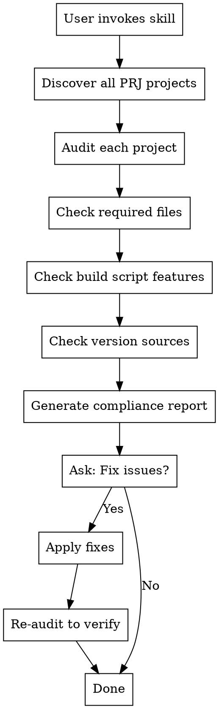

# macOS App Compliance Check

## Overview

This skill audits all macOS app projects in the workspace for DMG creation scripts, release notes, automatic versioning, license files, and other distribution infrastructure. It produces a compliance report and can automatically fix missing components.

**Related Skill:** For in-depth code review before App Store submission, see `app-store-code-review/SKILL.md`.

## When to Use

- Before releasing a new version of any macOS app
- When setting up a new macOS app project
- Periodic compliance audits across all projects
- After major infrastructure changes to verify consistency

## Project Discovery

All macOS app projects follow this structure:

```
<workspace>/
├── <AppName>PRJ/
│   ├── <AppName>CODE/           # Primary source location
│   │   ├── flutter_app/         # Flutter app (if nested)
│   │   ├── backend/             # Backend code
│   │   ├── scripts/             # Build scripts
│   │   └── ...
│   └── <AppName>WEB/            # Website repository
```

The skill automatically discovers all `*PRJ` directories in the workspace.

## Compliance Checklist

### 1. Required Files

| File | Purpose | Required |
|------|---------|----------|
| `scripts/build_dmg.sh` or `scripts/build-dmg.sh` | DMG creation script | YES |
| `RELEASE_NOTES.md` | Release documentation | YES |
| `LICENSE` | Source code license (BSL 1.1) | YES |
| `BINARY-LICENSE.txt` | Binary distribution license | YES |
| `LICENSE.md` | License overview document | YES |
| `README.md` | Project documentation | YES |
| `install.sh` | Installation script | YES |
| `issues.sh` | Diagnostic script | YES |

### 2. Build Script Features

The `build_dmg.sh` script MUST include:

| Feature | Description | Check Pattern |
|---------|-------------|---------------|
| **SHA256 Generation** | Checksum for DMG file | `shasum -a 256` |
| **Auto Version Extraction** | Read version from pubspec.yaml | `read_version.*pubspec\|VERSION.*grep.*pubspec` |
| **create-dmg Support** | Pretty DMG with window layout | `create-dmg` |
| **hdiutil Fallback** | Basic DMG creation fallback | `hdiutil create` |
| **License Embedding** | Copy LICENSE files to app bundle | `LICENSE\|BINARY-LICENSE` in script |
| **Release Notes Copy** | Copy RELEASE_NOTES.md to dist/ | `RELEASE_NOTES` in script |
| **dist/ Directory** | Output directory for artifacts | `DIST_DIR\|dist/` |

### 3. Version Sources

Projects MUST have at least one version source:

| Location | Format |
|----------|--------|
| `flutter_app/pubspec.yaml` | `version: X.Y.Z+N` |
| `pubspec.yaml` (root) | `version: X.Y.Z+N` |
| `flutter_app/lib/version.dart` | `const String appVersion = "X.Y.Z";` |
| `backend/version.py` | `VERSION = "X.Y.Z"` |

### 4. Control Scripts (bin/)

| Script | Purpose |
|--------|---------|
| `bin/appctl` or `bin/<app>ctl` | Service control (up/down/status/logs) |
| `bin/<app>_mcp_server.py` | MCP server for Claude integration |

## Audit Procedure

### Step 1: Discover Projects

```bash
# Find all PRJ directories in workspace
ls -d <workspace>/*PRJ 2>/dev/null
```

### Step 2: Audit Each Project

For each project, check:

```bash
PROJECT_DIR="<path_to_CODE_directory>"

# Required files
[ -f "$PROJECT_DIR/scripts/build_dmg.sh" ] || [ -f "$PROJECT_DIR/scripts/build-dmg.sh" ]
[ -f "$PROJECT_DIR/RELEASE_NOTES.md" ]
[ -f "$PROJECT_DIR/LICENSE" ]
[ -f "$PROJECT_DIR/BINARY-LICENSE.txt" ]
[ -f "$PROJECT_DIR/LICENSE.md" ]
[ -f "$PROJECT_DIR/README.md" ]
[ -f "$PROJECT_DIR/install.sh" ]
[ -f "$PROJECT_DIR/issues.sh" ]

# Build script features (if script exists)
BUILD_SCRIPT="$PROJECT_DIR/scripts/build_dmg.sh"
grep -q 'shasum' "$BUILD_SCRIPT"           # SHA256
grep -qE 'read_version|VERSION.*pubspec' "$BUILD_SCRIPT"  # Auto version
grep -q 'create-dmg' "$BUILD_SCRIPT"       # create-dmg
grep -q 'hdiutil' "$BUILD_SCRIPT"          # hdiutil fallback
grep -qE 'LICENSE|BINARY-LICENSE' "$BUILD_SCRIPT"  # License embedding
grep -q 'RELEASE_NOTES' "$BUILD_SCRIPT"    # Release notes copy
```

### Step 3: Generate Report

Output format:

```markdown
# macOS App Compliance Report

**Generated:** YYYY-MM-DD HH:MM:SS
**Projects Audited:** N

## Summary

| Project | Status | Issues |
|---------|--------|--------|
| AppName | PASS/FAIL | N issues |
| ... | ... | ... |

## Detailed Results

### Project: <AppName>

**Path:** `<path>`
**Status:** PASS/FAIL

#### Required Files
- [x] scripts/build_dmg.sh
- [ ] RELEASE_NOTES.md (MISSING)
- ...

#### Build Script Features
- [x] SHA256 generation
- [ ] Auto version extraction (MISSING)
- ...

#### Issues Found
1. Missing RELEASE_NOTES.md
2. Build script lacks auto version extraction

#### Recommended Fixes
- Create RELEASE_NOTES.md using template
- Add version extraction to build script
```

## Fix Templates

### RELEASE_NOTES.md Template

```markdown
# <AppName> v1.0.0 Release Notes

**Release Date:** <Month> <Year>

## Overview

<AppName> v1.0.0 is the initial release of <brief description>.

## Features

### <Category 1>
- **Feature**: Description

### <Category 2>
- **Feature**: Description

## Technical Details

- **Version**: 1.0.0 (build 1)
- **Platform**: macOS (Apple Silicon and Intel)
- **Framework**: Flutter 3.x
- **Minimum macOS**: 12.0 (Monterey)

## Installation

1. Download `<AppName>-1.0.0-macos.dmg`
2. Open the DMG and drag <AppName> to Applications
3. On first launch, right-click and select "Open" (Gatekeeper bypass)

## Checksums

SHA256 checksums are provided in `<AppName>-1.0.0-macos.dmg.sha256`

## Known Issues

- First launch requires Gatekeeper bypass

## License

- Source code: Business Source License 1.1 (`LICENSE`)
- Binary distribution: Binary Distribution License (`BINARY-LICENSE.txt`)

---

For bug reports: <contact_email>
```

### LICENSE.md Template

```markdown
# <AppName> Licensing Overview

Last updated: <Month> <Year>

## Summary

<AppName> is source-available under a BSL-style license. Source code use is allowed, while the official binary distribution has stricter terms.

## Source Code License (BSL 1.1)

- **License:** Business Source License 1.1
- **Scope:** Source code only
- **File:** `LICENSE`

## Binary Distribution License

- **License:** Binary Distribution License (EULA)
- **Scope:** DMG/app bundles and compiled binaries
- **File:** `BINARY-LICENSE.txt`
- **Key restriction:** No commercial use or redistribution

## What You Can Do

- Clone and modify the source code
- Build binaries for personal or internal use
- Use the source code as permitted by BSL parameters

## What You Cannot Do

- Sell or redistribute the official binary distribution
- Use the official binary for commercial purposes without license

## Need Commercial Rights?

Contact <contact_email> for commercial licensing.
```

### Build Script Version Extraction

Add to build script after APP_NAME definition:

```bash
# Auto-extract version from pubspec.yaml if not provided
read_version_from_pubspec() {
    local pubspec="$ROOT_DIR/flutter_app/pubspec.yaml"
    [ -f "$pubspec" ] || pubspec="$ROOT_DIR/pubspec.yaml"
    if [ -f "$pubspec" ]; then
        grep '^version:' "$pubspec" | head -1 | cut -d'+' -f1 | cut -d':' -f2 | xargs
    fi
}

VERSION="${1:-$(read_version_from_pubspec)}"
if [ -z "$VERSION" ]; then
    VERSION="1.0.0"
fi
```

### Build Script SHA256 Generation

Add after DMG creation:

```bash
# Generate SHA256 checksum
info "Generating SHA256 checksum..."
cd "$DIST_DIR"
shasum -a 256 "$DMG_NAME" > "$DMG_NAME.sha256"
SHA256=$(awk '{print $1}' "$DMG_NAME.sha256")
ok "SHA256: $SHA256"
```

### Build Script Release Notes Copy

Add after SHA256 generation:

```bash
# Copy release notes if present
RELEASE_NOTES_SRC="$ROOT_DIR/RELEASE_NOTES.md"
RELEASE_NOTES_NAME="${APP_NAME}-${VERSION}-RELEASE_NOTES.md"
if [ -f "$RELEASE_NOTES_SRC" ]; then
    cp "$RELEASE_NOTES_SRC" "$DIST_DIR/$RELEASE_NOTES_NAME"
    shasum -a 256 "$RELEASE_NOTES_NAME" > "$RELEASE_NOTES_NAME.sha256"
    ok "Release notes copied"
fi
```

### Build Script License Embedding

Add before DMG staging:

```bash
# Embed license files in app bundle
RESOURCES_DIR="$APP_PATH/Contents/Resources"
[ -f "$ROOT_DIR/LICENSE" ] && cp "$ROOT_DIR/LICENSE" "$RESOURCES_DIR/"
[ -f "$ROOT_DIR/BINARY-LICENSE.txt" ] && cp "$ROOT_DIR/BINARY-LICENSE.txt" "$RESOURCES_DIR/"

# Copy to DMG root
[ -f "$ROOT_DIR/LICENSE" ] && cp "$ROOT_DIR/LICENSE" "$DMG_STAGE/"
[ -f "$ROOT_DIR/BINARY-LICENSE.txt" ] && cp "$ROOT_DIR/BINARY-LICENSE.txt" "$DMG_STAGE/"
```

## Workflow



## User Interaction

After generating the report, ask the user:

1. **View detailed report?** - Show full compliance details
2. **Fix all issues automatically?** - Apply all fixes using templates
3. **Fix specific projects?** - Select which projects to fix
4. **Skip fixes?** - Just report, no changes

## Reference Implementation Pattern

A comprehensive build_dmg.sh for Python-bundled macOS apps should include:

- **~500+ lines** of production-tested bash
- **Mach-O binary patching** for portable Python bundling
- **Multi-pass dependency vendoring** for transitive dylib dependencies
- **MLX/PyTorch pruning** options for smaller Apple Silicon bundles
- **Backend launcher** with proper environment setup
- **Fallback** from create-dmg to hdiutil
- **SHA256 hash generation** for all artifacts
- **Source archive** via git

See the DMG Creation section in the main README for complete implementation details.

## Cross-Reference

After running this compliance check, consider running **app-store-code-review** skill for:

- Crash prevention analysis
- Resource management review
- Security audit
- Platform compliance (App Store specific)
- MCP integration verification
- Product information completeness

The compliance check ensures **infrastructure** is in place; the code review ensures **code quality** meets App Store standards.
