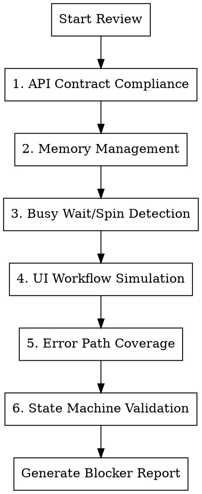

# Production Blocker Detection

## Overview

Systematic deep code review that identifies runtime bugs and production blockers that cause app crashes, hangs, or degraded user experience. This skill goes beyond static code review by simulating user workflows and verifying API contract compliance between frontend and backend.

**Core Principle:** Every user-facing workflow must be traced end-to-end from UI action through API call to backend handler and back.

## When to Use

- Before any production release
- After major feature implementation
- When debugging intermittent crashes or hangs
- When users report "app freezes" or "nothing happens" issues
- After backend API changes
- When adding new UI workflows

## Review Categories



## Severity Classification

| Severity | Definition | Examples |
|----------|------------|----------|
| **P0 (Blocker)** | Crashes app or makes feature unusable | Null pointer, infinite loop, deadlock |
| **P1 (Critical)** | Severe degradation, data loss risk | Memory leak, race condition |
| **P2 (Major)** | Feature broken under certain conditions | Missing error handling, timeout |
| **P3 (Minor)** | Degraded experience but functional | Slow response, UI flicker |

## 1. API Contract Compliance

Verify every frontend API call matches backend expectations exactly.

### Discovery Checklist

- [ ] List all API endpoints from backend (FastAPI routes, Flask routes, etc.)
- [ ] List all API calls from frontend (ApiService, http calls, fetch requests)
- [ ] Cross-reference: every frontend call has matching backend endpoint
- [ ] Cross-reference: every backend endpoint is called by frontend (or documented as internal)

### Contract Verification

For each API endpoint, verify:

| Check | Frontend | Backend | Blocker If Mismatch |
|-------|----------|---------|---------------------|
| **HTTP Method** | `POST /api/foo` | `@app.post("/api/foo")` | YES - 405 error |
| **URL Path** | `/api/jobs` | `/api/job` (singular) | YES - 404 error |
| **Query Params** | `?status=active` | `status: str = Query(...)` | YES - validation error |
| **Request Body** | `{"text": "..."}` | `class Request(text: str)` | YES - 422 error |
| **Response Shape** | `data.items[0].id` | `{"items": [...]}` | YES - undefined access |
| **Response Status** | `if (res.ok)` | `return JSONResponse(...)` | P1 - silent failure |
| **Content-Type** | `Accept: application/json` | `media_type="application/json"` | P1 - parse error |

### Code Patterns to Search

**Frontend (Dart/Flutter):**
```dart
// Search for all API calls
http.get|post|put|delete|patch
dio.get|post|put|delete|patch
ApiService.*\(
fetch\(
```

**Backend (Python/FastAPI):**
```python
# Search for all route definitions
@app\.(get|post|put|delete|patch)
@router\.(get|post|put|delete|patch)
```

### Common API Mismatches

| Issue | Frontend Code | Backend Code | Fix |
|-------|---------------|--------------|-----|
| Path mismatch | `GET /api/models` | `GET /api/model` | Align paths |
| Missing trailing slash | `POST /api/jobs` | `POST /api/jobs/` | Remove backend slash or add redirect |
| Query vs Body | `?text=hello` | `Body(text: str)` | Change to body or query |
| Nested vs flat response | `data.result.items` | `{"items": [...]}` | Fix nesting |
| Wrong field name | `item.modelName` | `{"model_name": ...}` | Match snake_case/camelCase |

### Automated Check Pattern

```bash
# Extract all backend routes
grep -rn '@app\.\(get\|post\|put\|delete\|patch\)' backend/ | \
  sed 's/.*@app\.\([a-z]*\)("\([^"]*\)".*/\1 \2/' | sort > backend_routes.txt

# Extract all frontend API calls
grep -rn 'http\.\(get\|post\|put\|delete\|patch\)\|ApiService' lib/ | \
  sed 's/.*\(get\|post\|put\|delete\|patch\)[^"]*"\([^"]*\)".*/\1 \2/' | sort > frontend_calls.txt

# Compare
diff backend_routes.txt frontend_calls.txt
```

## 2. Memory Management

Detect memory leaks, unbounded growth, and resource exhaustion.

### Flutter/Dart Memory Checklist

- [ ] All `StreamSubscription` cancelled in `dispose()`
- [ ] All `Timer` and `Timer.periodic` cancelled in `dispose()`
- [ ] All `AnimationController` disposed
- [ ] All `TextEditingController` disposed
- [ ] All `ScrollController` disposed
- [ ] All `FocusNode` disposed
- [ ] No growing lists without bounds (history, logs, queue items)
- [ ] Image cache has size limits
- [ ] WebSocket connections closed on dispose

### Python/Backend Memory Checklist

- [ ] File handles closed (use `with` statements)
- [ ] Database connections returned to pool
- [ ] Large objects cleared after processing
- [ ] No growing dictionaries/lists without cleanup
- [ ] Temp files deleted after use
- [ ] Model/tensor memory released after inference
- [ ] Thread pool has max workers limit
- [ ] Queue has max size limit

### Dangerous Patterns

```dart
// BAD: Timer never cancelled
Timer.periodic(Duration(seconds: 1), (timer) {
  updateStats();  // Keeps running after widget disposed
});

// GOOD: Cancel in dispose
Timer? _statsTimer;

void initState() {
  _statsTimer = Timer.periodic(Duration(seconds: 1), (timer) {
    if (mounted) updateStats();
  });
}

void dispose() {
  _statsTimer?.cancel();
  super.dispose();
}
```

```dart
// BAD: Stream listener never cancelled
stream.listen((data) {
  setState(() { items.add(data); });  // Memory leak + crash after dispose
});

// GOOD: Store and cancel subscription
StreamSubscription? _subscription;

void initState() {
  _subscription = stream.listen((data) {
    if (mounted) setState(() { items.add(data); });
  });
}

void dispose() {
  _subscription?.cancel();
  super.dispose();
}
```

```python
# BAD: Growing history without limit
job_history = []
def add_job(job):
    job_history.append(job)  # Unbounded growth

# GOOD: Limit history size
from collections import deque
job_history = deque(maxlen=1000)
def add_job(job):
    job_history.append(job)  # Auto-evicts oldest
```

### Memory Search Patterns

```bash
# Find uncancelled timers
grep -rn 'Timer.periodic\|Timer(' lib/ | grep -v 'cancel'

# Find stream listeners without cancel
grep -rn '\.listen(' lib/ | grep -v 'subscription\|_sub\|cancel'

# Find growing lists
grep -rn '\.add(\|\.addAll(' lib/ | grep -v 'maxLength\|limit\|remove'

# Find missing dispose
grep -rn 'Controller()\|FocusNode()' lib/ | while read line; do
  file=$(echo "$line" | cut -d: -f1)
  grep -L 'dispose()' "$file"
done
```

## 3. Busy Wait/Spin Loop Detection

Detect CPU-burning loops that freeze the UI or exhaust resources.

### Busy Wait Patterns to Find

| Pattern | Code Example | Problem | Fix |
|---------|--------------|---------|-----|
| **Polling loop** | `while (!ready) { check(); }` | Burns CPU | Use `await Future.delayed()` |
| **Tight retry** | `while (true) { try { ... } catch { continue; } }` | Infinite retry | Add delay + max retries |
| **Active wait** | `while (DateTime.now() < deadline) {}` | CPU spin | Use `Future.delayed(deadline.difference(...))` |
| **No yield** | `for (item in hugeList) { process(item); }` | UI freeze | Use `compute()` or `Isolate` |

### Search Patterns

```bash
# Find while(true) loops
grep -rn 'while\s*(true)\|while\s*(1)' lib/ backend/

# Find loops without await/yield
grep -rn 'while\s*(' lib/ | grep -v 'await\|yield\|sleep\|delay'

# Find retry without delay
grep -rn 'catch.*continue\|except.*continue' lib/ backend/

# Find polling without delay
grep -rn 'while.*!\|while.*==\s*false' lib/ | grep -v 'await'
```

### Correct Patterns

```dart
// BAD: Busy wait for backend
while (!backendReady) {
  backendReady = await checkHealth();  // Still burns CPU
}

// GOOD: Exponential backoff
int delay = 100;
for (int i = 0; i < 10; i++) {
  if (await checkHealth()) return true;
  await Future.delayed(Duration(milliseconds: delay));
  delay = (delay * 1.5).toInt().clamp(100, 5000);
}
throw TimeoutException('Backend not ready');
```

```python
# BAD: Spin loop waiting for file
while not os.path.exists(output_file):
    pass  # CPU at 100%

# GOOD: Event-based or polling with sleep
import time
for _ in range(60):  # Max 60 seconds
    if os.path.exists(output_file):
        break
    time.sleep(1)
else:
    raise TimeoutError("Output file not created")
```

## 4. UI Workflow Simulation

Trace every user interaction from tap/click through to completion.

### Workflow Discovery

List all user-facing workflows:

1. **Navigation Flows:** Each tab/page transition
2. **CRUD Operations:** Create, read, update, delete actions
3. **Background Tasks:** Jobs, downloads, processing
4. **Settings:** Each preference change
5. **Error Recovery:** Retry, cancel, dismiss

### Per-Workflow Checklist

For each workflow, verify:

| Step | Check | Blocker If Missing |
|------|-------|-------------------|
| **1. Trigger** | Button enabled/visible when expected | YES - dead UI |
| **2. Loading** | Loading indicator shown | P2 - confused user |
| **3. API Call** | Correct endpoint called | YES - feature broken |
| **4. Success** | UI updates with result | YES - silent failure |
| **5. Error** | Error message shown | P1 - confused user |
| **6. Cancel** | Can abort in-progress operation | P2 - stuck UI |
| **7. Retry** | Can retry after failure | P2 - dead end |

### Workflow Tracing Template

```markdown
## Workflow: [Name]

**Trigger:** [User action]
**Expected Result:** [What should happen]

### Trace

1. UI Element: `lib/screens/foo_screen.dart:42` - `onPressed: _handleFoo`
2. Handler: `lib/screens/foo_screen.dart:100` - `_handleFoo()`
3. API Call: `lib/services/api_service.dart:50` - `createFoo(data)`
4. HTTP: `POST /api/foo` with body `{...}`
5. Backend: `backend/main.py:120` - `@app.post("/api/foo")`
6. Response: `{"id": "...", "status": "created"}`
7. UI Update: `lib/screens/foo_screen.dart:110` - `setState(() { ... })`

### Verified States

- [x] Button disabled during loading
- [x] Loading spinner shown
- [x] Success: navigates to detail page
- [x] Error: shows snackbar with message
- [ ] Cancel: NOT IMPLEMENTED (P2 blocker)
- [x] Retry: button re-enabled after error
```

### Critical Workflows to Test

| Workflow | Entry Point | Expected Flow |
|----------|-------------|---------------|
| App startup | `main.dart` | Splash -> Health check -> Main screen |
| Create item | Create button | Form -> Submit -> List updates |
| Delete item | Delete button | Confirm -> API -> Item removed |
| Background job | Start button | Queue -> Progress -> Complete |
| Settings change | Toggle/input | Save -> Persist -> Apply |
| Error recovery | API failure | Error shown -> Retry available |

### Workflow Failure Modes

| Failure | Symptom | Check |
|---------|---------|-------|
| Dead button | Tap does nothing | `onPressed` is null or widget not mounted |
| Silent failure | Nothing happens | Missing error handling or setState |
| Stuck loading | Spinner forever | API timeout not handled, no error path |
| State desync | UI shows stale data | Missing refresh after mutation |
| Double-tap crash | Exception on quick taps | No debounce, operation not idempotent |

## 5. Error Path Coverage

Every API call and async operation needs error handling.

### Error Handling Checklist

- [ ] All `try/catch` blocks have meaningful error handling (not empty catch)
- [ ] All HTTP calls handle network errors (timeout, no connection)
- [ ] All HTTP calls handle 4xx errors (validation, not found, unauthorized)
- [ ] All HTTP calls handle 5xx errors (server error, unavailable)
- [ ] All file operations handle missing file, permission denied
- [ ] All JSON parsing handles malformed response
- [ ] User sees actionable error message for all failures
- [ ] Errors are logged with context for debugging

### Search for Missing Error Handling

```bash
# Find try without catch
grep -rn 'try\s*{' lib/ | while read line; do
  file=$(echo "$line" | cut -d: -f1)
  linenum=$(echo "$line" | cut -d: -f2)
  if ! sed -n "${linenum},$((linenum+20))p" "$file" | grep -q 'catch'; then
    echo "Missing catch: $line"
  fi
done

# Find async without try/catch
grep -rn 'async\s*{' lib/ | while read line; do
  file=$(echo "$line" | cut -d: -f1)
  linenum=$(echo "$line" | cut -d: -f2)
  if ! sed -n "${linenum},$((linenum+30))p" "$file" | grep -q 'try\|catch'; then
    echo "Async without error handling: $line"
  fi
done

# Find empty catch blocks
grep -rn 'catch.*{\s*}' lib/ backend/
grep -rn 'except.*:\s*pass' backend/
```

### Error Handling Patterns

```dart
// BAD: Silent failure
try {
  await api.createJob(data);
} catch (e) {
  // Nothing - user has no idea it failed
}

// GOOD: User feedback + logging
try {
  await api.createJob(data);
  showSuccess('Job created');
} on NetworkException catch (e) {
  showError('Network error. Check connection and retry.');
  log.error('Network error creating job', error: e);
} on ApiException catch (e) {
  showError(e.userMessage);
  log.error('API error creating job: ${e.code}', error: e);
} catch (e, stack) {
  showError('Unexpected error. Please try again.');
  log.error('Unexpected error creating job', error: e, stackTrace: stack);
}
```

## 6. State Machine Validation

Validate that state transitions are legal and complete.

### Common State Machines

| Entity | States | Transitions |
|--------|--------|-------------|
| **Job** | pending -> running -> completed/failed | Only forward |
| **Download** | idle -> downloading -> completed/failed | Can cancel |
| **Connection** | disconnected -> connecting -> connected | Can fail |
| **Form** | editing -> submitting -> submitted/error | Can reset |

### State Validation Checklist

- [ ] All states are reachable (no orphan states)
- [ ] All transitions are explicit (no implicit state changes)
- [ ] Invalid transitions are prevented (not just undocumented)
- [ ] UI reflects current state accurately
- [ ] State persists correctly across restarts

### State Machine Bugs

| Bug | Code Pattern | Fix |
|-----|--------------|-----|
| **Orphan state** | State exists but unreachable | Add transition or remove state |
| **Missing transition** | Can't go from A to B | Add transition handler |
| **Invalid transition** | A -> C skipping B | Validate in transition |
| **Stale UI** | State changed, UI unchanged | Notify listeners |
| **Race condition** | Two transitions at once | Lock or queue transitions |

```dart
// BAD: Unvalidated state transition
void updateJob(String id, JobStatus status) {
  jobs[id]?.status = status;  // Any transition allowed
}

// GOOD: Validated transition
void updateJob(String id, JobStatus newStatus) {
  final job = jobs[id];
  if (job == null) throw StateError('Job not found');

  final validTransitions = {
    JobStatus.pending: [JobStatus.running, JobStatus.cancelled],
    JobStatus.running: [JobStatus.completed, JobStatus.failed],
    JobStatus.completed: [],  // Terminal
    JobStatus.failed: [JobStatus.pending],  // Can retry
  };

  if (!validTransitions[job.status]!.contains(newStatus)) {
    throw StateError('Invalid transition: ${job.status} -> $newStatus');
  }

  jobs[id] = job.copyWith(status: newStatus);
  notifyListeners();
}
```

## Audit Procedure

### Step 1: Inventory

```bash
# List all screens/pages
find lib -name '*_screen.dart' -o -name '*_page.dart'

# List all API endpoints
grep -rn '@app\.\|@router\.' backend/

# List all API calls
grep -rn 'http\.\|ApiService\.' lib/

# List all state classes
grep -rn 'ChangeNotifier\|StateNotifier\|Cubit\|Bloc' lib/
```

### Step 2: Cross-Reference

Create mapping table:

| UI Screen | API Calls | Backend Endpoints | State |
|-----------|-----------|-------------------|-------|
| JobsScreen | getJobs, createJob | GET /api/jobs, POST /api/jobs | JobsProvider |

### Step 3: Trace Workflows

For each screen, trace all user interactions end-to-end.

### Step 4: Generate Report

```markdown
# Production Blocker Report

**Project:** <name>
**Date:** YYYY-MM-DD
**Reviewer:** Claude

## Executive Summary

- **P0 Blockers:** N
- **P1 Critical:** N
- **P2 Major:** N
- **P3 Minor:** N
- **Recommendation:** BLOCK RELEASE / FIX BEFORE RELEASE / RELEASE OK

## P0 Blockers (Must Fix)

### B001: API Path Mismatch - Jobs Endpoint
**Category:** API Contract
**File:** lib/services/api_service.dart:45
**Severity:** P0 - Feature completely broken

**Problem:**
Frontend calls `GET /api/jobs` but backend defines `GET /api/job` (singular).

**Evidence:**
```dart
// Frontend
final response = await http.get(Uri.parse('$baseUrl/api/jobs'));
```
```python
# Backend
@app.get("/api/job")
def list_jobs():
```

**Impact:** Jobs screen shows empty list, users cannot see any jobs.

**Fix:**
Change backend route to `/api/jobs` or frontend call to `/api/job`.

---

## P1 Critical (Should Fix)

### C001: Timer Not Cancelled in JobsScreen
...

## API Contract Audit

| Frontend Call | Backend Route | Match | Issue |
|---------------|---------------|-------|-------|
| GET /api/jobs | GET /api/job | NO | Path mismatch |
| POST /api/jobs | POST /api/jobs | YES | - |

## Workflow Audit

| Workflow | Trace Complete | Blockers |
|----------|----------------|----------|
| Create Job | YES | None |
| Delete Job | NO | Missing confirm dialog |

## Memory Audit

| Resource | Created | Disposed | Issue |
|----------|---------|----------|-------|
| _statsTimer | initState:42 | NOT DISPOSED | P1 leak |

## Recommendations

1. Fix API path mismatch (P0)
2. Add timer disposal (P1)
3. Add delete confirmation (P2)
```

## Quick Commands

After review, offer fixes:

1. **"Fix all P0 blockers"** - Implement critical fixes only
2. **"Fix P0 + P1"** - Fix blockers and critical issues
3. **"Generate full trace"** - Complete workflow documentation
4. **"Run API audit"** - Focus on API compliance only

## Red Flags - Immediate Attention

- API path mismatch between frontend and backend
- `while (true)` or `while (!done)` without `await`/`sleep`
- `Timer.periodic` without corresponding `cancel()` in `dispose()`
- Stream `.listen()` without subscription stored for cancellation
- Empty `catch (e) {}` or `except: pass` blocks
- `setState()` without `if (mounted)` check in async callback
- Growing collection without size limit (history, logs, cache)
- No error message shown to user on API failure
- State change without UI notification (`notifyListeners()`)
- Backend endpoint without corresponding frontend call (dead code)
- Frontend API call without corresponding backend endpoint (404)
