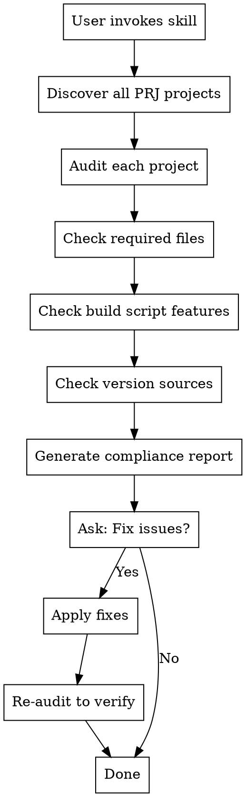

# Apple Platform Compliance Check

## Overview

This skill audits Apple-platform app projects in the workspace for release infrastructure, versioning, publication hygiene, website/download integrity, model/documentation parity, and distribution blockers.

Primary focus:
- macOS desktop distribution (`.dmg`) infrastructure
- iOS/iPad distribution (`.ipa` + App Store Connect/TestFlight) preflight delegation

**Related Skills:**
- For in-depth code review before App Store submission, see `osx-review/SKILL.md`.
- For iOS/iPad upload/submission checks, see `osx-ios/SKILL.md`.

## When to Use

- Before releasing a new version of any macOS, iOS, or iPad app
- When setting up a new macOS app project
- Periodic compliance audits across all projects
- After major infrastructure changes to verify consistency

## iOS/iPad Companion Gate

If a project contains an iOS target, this skill MUST require a passed `osx-ios` preflight:

```bash
bash ./skills/osx-ios/scripts/check_ios_dist.sh --app-root <APP_ROOT>
```

Treat any `FAIL` result as release-blocking before TestFlight/App Store actions.

## Project Discovery

All macOS app projects follow this structure:

```
<workspace>/
├── <AppName>PRJ/
│   ├── <AppName>CODE/           # Primary source location
│   │   ├── flutter_app/         # Flutter app (if nested)
│   │   ├── backend/             # Backend code
│   │   ├── scripts/             # Build scripts
│   │   └── ...
│   └── <AppName>WEB/            # Website repository
```

The skill automatically discovers all `*PRJ` directories in the workspace.

## Compliance Checklist

### 1. Required Files

| File | Purpose | Required |
|------|---------|----------|
| `scripts/build_dmg.sh` or `scripts/build-dmg.sh` | DMG creation script | YES |
| `RELEASE_NOTES.md` | Release documentation | YES |
| `LICENSE` | Source code license (BSL 1.1) | YES |
| `BINARY-LICENSE.txt` | Binary distribution license | YES |
| `LICENSE.md` | License overview document | YES |
| `README.md` | Project documentation | YES |
| `install.sh` | Installation script | YES |
| `issues.sh` | Diagnostic script | YES |
| `scripts/release.sh` | End-to-end release automation | YES |

### 2. Build Script Features

The `build_dmg.sh` script MUST include:

| Feature | Description | Check Pattern |
|---------|-------------|---------------|
| **SHA256 Generation** | Checksum for DMG file | `shasum -a 256` |
| **Auto Version Extraction** | Read version from pubspec.yaml | `read_version.*pubspec\|VERSION.*grep.*pubspec` |
| **create-dmg Support** | Pretty DMG with window layout | `create-dmg` |
| **hdiutil Fallback** | Basic DMG creation fallback | `hdiutil create` |
| **License Embedding** | Copy LICENSE files to app bundle | `LICENSE\|BINARY-LICENSE` in script |
| **Release Notes Copy** | Copy RELEASE_NOTES.md to dist/ | `RELEASE_NOTES` in script |
| **dist/ Directory** | Output directory for artifacts | `DIST_DIR\|dist/` |

### 3. Version Sources

Projects MUST have at least one version source:

| Location | Format |
|----------|--------|
| `flutter_app/pubspec.yaml` | `version: X.Y.Z+N` |
| `pubspec.yaml` (root) | `version: X.Y.Z+N` |
| `flutter_app/lib/version.dart` | `const String appVersion = "X.Y.Z";` |
| `backend/version.py` | `VERSION = "X.Y.Z"` |

### 4. Control Scripts (bin/)

| Script | Purpose |
|--------|---------|
| `bin/appctl` or `bin/<app>ctl` | Service control (up/down/status/logs) |
| `bin/<app>_mcp_server.py` | MCP server for Claude integration |

### 5. Window-Close Backend Shutdown UX (Release Blocker)

Desktop apps with bundled local backends MUST shut down the backend when the user closes the app window.

| Requirement | Description | Check Pattern |
|-------------|-------------|---------------|
| **Exit interception** | App intercepts window close / app-exit request before terminating | `onExitRequested\|didRequestAppExit\|WindowListener` |
| **Shutdown call** | Exit path calls backend stop logic | `stopBackend\|stop_server\|shutdown_backend` |
| **Stopping dialog/UI** | Close path displays visible "Stopping server/backend" progress UI | `Stopping Server\|Stopping backend\|stop.*before exit` |
| **No orphan backend** | Post-close check confirms backend port/process is gone | `lsof -iTCP` / process check in smoke test docs |

### 6. GitHub Release + Website Sync (Release Blocker)

Every DMG release must produce a real, populated GitHub release and matching website links.

| Requirement | Description | Check Pattern |
|-------------|-------------|---------------|
| **Release automation** | `scripts/release.sh` creates/updates GitHub release and uploads assets | `gh release create\|gh release upload` |
| **No empty releases** | Release page must contain assets (not tag-only) | `gh release view --json assets` |
| **Required assets** | Release includes DMG, DMG SHA256, source ZIP, source ZIP SHA256, release notes, release notes SHA256 | `-arm64.dmg\|source.zip\|RELEASE_NOTES` |
| **Direct DMG links** | Website download buttons/nav resolve directly to current DMG asset URL | `/releases/download/v.*/.*\\.dmg` |
| **Version alignment** | Version badge/text, release tag, and artifact filenames match | `v[0-9]+\\.[0-9]+\\.[0-9]+` or project format |
| **Gatekeeper instructions** | If unsigned/not notarized, release notes include explicit launch steps and security path | `Unsigned DMG.*Gatekeeper\|Open Anyway` |

### 7. Documentation and Model-Catalog Parity (Release Blocker)

| Requirement | Description | Check Pattern |
|-------------|-------------|---------------|
| **README model table complete** | README lists all app-shipped/supported model variants (including quantized aliases/namespaces where applicable) | `## Supported Models` |
| **Website model table complete** | Website "Supported Models" mirrors README/app capability set | `Supported Models` in `<AppName>WEB` |
| **Pregenerated samples indexed** | README includes pregenerated example index for shipped demos | `pregenerated` |
| **Capability accuracy** | Marketing/docs do not claim unsupported capabilities (for example, cloning on non-cloning models) | manual diff vs runtime engines |
| **First-run guidance present** | README/website include first-launch backend warm-up and model-download guidance | `startup log\|Download` |

### 8. Clean-Machine First-Run Validation (Release Blocker)

| Requirement | Description | Check Pattern |
|-------------|-------------|---------------|
| **No stale app collision** | Old copies in `/Applications` removed before smoke testing new DMG | manual check |
| **No stale model cache assumption** | Validate first run with empty app-scoped cache/models | app-specific cache path check |
| **Backend port conflict handling** | App surfaces clear "restart/stop conflicting process" path if port is in use | `port in use\|Restart Server` |
| **Bundled PDF serving check** | `/api/pdf/list` and `/pdf/<file>` work from bundled build | health smoke test |
| **Relative resource pathing** | Bundled backend uses app-relative/runtime paths, never source checkout paths | no hardcoded repo paths |

## Audit Procedure

### Step 1: Discover Projects

```bash
# Find all PRJ directories in workspace
ls -d <workspace>/*PRJ 2>/dev/null
```

### Step 2: Audit Each Project

For each project, check:

```bash
PROJECT_DIR="<path_to_CODE_directory>"

# Required files
[ -f "$PROJECT_DIR/scripts/build_dmg.sh" ] || [ -f "$PROJECT_DIR/scripts/build-dmg.sh" ]
[ -f "$PROJECT_DIR/RELEASE_NOTES.md" ]
[ -f "$PROJECT_DIR/LICENSE" ]
[ -f "$PROJECT_DIR/BINARY-LICENSE.txt" ]
[ -f "$PROJECT_DIR/LICENSE.md" ]
[ -f "$PROJECT_DIR/README.md" ]
[ -f "$PROJECT_DIR/install.sh" ]
[ -f "$PROJECT_DIR/issues.sh" ]
[ -f "$PROJECT_DIR/scripts/release.sh" ]

# Build script features (if script exists)
BUILD_SCRIPT="$PROJECT_DIR/scripts/build_dmg.sh"
grep -q 'shasum' "$BUILD_SCRIPT"           # SHA256
grep -qE 'read_version|VERSION.*pubspec' "$BUILD_SCRIPT"  # Auto version
grep -q 'create-dmg' "$BUILD_SCRIPT"       # create-dmg
grep -q 'hdiutil' "$BUILD_SCRIPT"          # hdiutil fallback
grep -qE 'LICENSE|BINARY-LICENSE' "$BUILD_SCRIPT"  # License embedding
grep -q 'RELEASE_NOTES' "$BUILD_SCRIPT"    # Release notes copy

# Release script checks
RELEASE_SCRIPT="$PROJECT_DIR/scripts/release.sh"
grep -q 'gh release create' "$RELEASE_SCRIPT"
grep -q 'gh release upload' "$RELEASE_SCRIPT"
grep -qE 'source\\.zip|RELEASE_NOTES' "$RELEASE_SCRIPT"

# Window-close backend shutdown UX (Flutter desktop apps with local backend)
MAIN_DART="$PROJECT_DIR/flutter_app/lib/main.dart"
if [ -f "$MAIN_DART" ] && [ -d "$PROJECT_DIR/backend" ]; then
  grep -qE 'onExitRequested|didRequestAppExit|WindowListener' "$MAIN_DART"
  grep -qE 'stopBackend|stop_server|shutdown_backend' "$MAIN_DART"
  grep -qE 'Stopping Server|Stopping backend' "$MAIN_DART"
fi

# Website direct-download link checks (if website repo exists)
PROJECT_PARENT="$(dirname "$PROJECT_DIR")"
PRJ_NAME="$(basename "$PROJECT_PARENT")"
APP_PREFIX="${PRJ_NAME%PRJ}"
WEBSITE_DIR="$PROJECT_PARENT/${APP_PREFIX}WEB"
if [ -d "$WEBSITE_DIR" ]; then
  rg -n '/releases/download/.+\\.dmg' "$WEBSITE_DIR"/*.html
fi
```

### Step 3: Generate Report

Output format:

```markdown
# macOS App Compliance Report

**Generated:** YYYY-MM-DD HH:MM:SS
**Projects Audited:** N

## Summary

| Project | Status | Issues |
|---------|--------|--------|
| AppName | PASS/FAIL | N issues |
| ... | ... | ... |

## Detailed Results

### Project: <AppName>

**Path:** `<path>`
**Status:** PASS/FAIL

#### Required Files
- [x] scripts/build_dmg.sh
- [ ] RELEASE_NOTES.md (MISSING)
- ...

#### Build Script Features
- [x] SHA256 generation
- [ ] Auto version extraction (MISSING)
- ...

#### Window-Close Backend Shutdown UX
- [x] Exit interception implemented
- [x] Backend stop invoked during close
- [x] Stopping dialog shown during close
- [ ] No orphan backend validation documented (MISSING)

#### GitHub Release + Website Sync
- [x] release.sh automates release upload
- [ ] Release assets incomplete (MISSING SOURCE ZIP SHA)
- [ ] Website download button points to non-DMG URL (MISSING)

#### Documentation and Model-Catalog Parity
- [x] README has Supported Models section
- [ ] Website model table missing variants (MISSING)
- [ ] Pregenerated sample index incomplete (MISSING)

#### Issues Found
1. Missing RELEASE_NOTES.md
2. Build script lacks auto version extraction

#### Recommended Fixes
- Create RELEASE_NOTES.md using template
- Add version extraction to build script
```

## Fix Templates

### Flutter Window-Close Backend Shutdown Pattern

For Flutter desktop apps with a bundled backend, add an exit-request hook that blocks immediate app termination, shows a stopping dialog, stops backend, then exits:

```dart
AppLifecycleListener? _appLifecycleListener;
bool _allowImmediateExit = false;
bool _isShuttingDown = false;

@override
void initState() {
  super.initState();
  _appLifecycleListener = AppLifecycleListener(
    onExitRequested: _handleExitRequested,
  );
}

Future<AppExitResponse> _handleExitRequested() async {
  if (_allowImmediateExit) return AppExitResponse.exit;
  if (_isShuttingDown) return AppExitResponse.cancel;
  _isShuttingDown = true;
  _showStoppingDialog();
  await backendService.stopBackend();
  _allowImmediateExit = true;
  await SystemNavigator.pop();
  return AppExitResponse.cancel;
}
```

Also add a smoke test step:

- Launch app from `/Applications`
- Close window
- Confirm stopping dialog appears
- Confirm backend process/port is gone (`lsof -iTCP:<port> -sTCP:LISTEN`)

### RELEASE_NOTES.md Template

```markdown
# <AppName> v1.0.0 Release Notes

**Release Date:** <Month> <Year>

## Overview

<AppName> v1.0.0 is the initial release of <brief description>.

## Features

### <Category 1>
- **Feature**: Description

### <Category 2>
- **Feature**: Description

## Technical Details

- **Version**: 1.0.0 (build 1)
- **Platform**: macOS (Apple Silicon and Intel)
- **Framework**: Flutter 3.x
- **Minimum macOS**: 12.0 (Monterey)

## Installation

1. Download `<AppName>-1.0.0-macos.dmg`
2. Open the DMG and drag <AppName> to Applications
3. On first launch, right-click and select "Open" (Gatekeeper bypass)

## Unsigned DMG (Apple Gatekeeper)

As of <Month DD, YYYY>, the <AppName> DMG is not yet signed/notarized by Apple.
macOS may block first launch until you explicitly allow it in security settings.

1. Open the DMG and drag <AppName>.app to Applications.
2. In Applications, right-click <AppName>.app and select Open.
3. Click Open in the warning dialog.
4. If macOS still blocks launch, go to: System Settings -> Privacy & Security -> Open Anyway (for <AppName>), then confirm with password/Touch ID.
5. On first launch, wait for the bundled backend to start. A startup-log screen for a few seconds is expected.
6. On first use, click Download for any required model in the in-app model card.

## Checksums

SHA256 checksums are provided in `<AppName>-1.0.0-macos.dmg.sha256`

## Known Issues

- First launch requires Gatekeeper bypass

## License

- Source code: Business Source License 1.1 (`LICENSE`)
- Binary distribution: Binary Distribution License (`BINARY-LICENSE.txt`)

---

For bug reports: <contact_email>
```

### LICENSE.md Template

```markdown
# <AppName> Licensing Overview

Last updated: <Month> <Year>

## Summary

<AppName> is source-available under a BSL-style license. Source code use is allowed, while the official binary distribution has stricter terms.

## Source Code License (BSL 1.1)

- **License:** Business Source License 1.1
- **Scope:** Source code only
- **File:** `LICENSE`

## Binary Distribution License

- **License:** Binary Distribution License (EULA)
- **Scope:** DMG/app bundles and compiled binaries
- **File:** `BINARY-LICENSE.txt`
- **Key restriction:** No commercial use or redistribution

## What You Can Do

- Clone and modify the source code
- Build binaries for personal or internal use
- Use the source code as permitted by BSL parameters

## What You Cannot Do

- Sell or redistribute the official binary distribution
- Use the official binary for commercial purposes without license

## Need Commercial Rights?

Contact <contact_email> for commercial licensing.
```

### Build Script Version Extraction

Add to build script after APP_NAME definition:

```bash
# Auto-extract version from pubspec.yaml if not provided
read_version_from_pubspec() {
    local pubspec="$ROOT_DIR/flutter_app/pubspec.yaml"
    [ -f "$pubspec" ] || pubspec="$ROOT_DIR/pubspec.yaml"
    if [ -f "$pubspec" ]; then
        grep '^version:' "$pubspec" | head -1 | cut -d'+' -f1 | cut -d':' -f2 | xargs
    fi
}

VERSION="${1:-$(read_version_from_pubspec)}"
if [ -z "$VERSION" ]; then
    VERSION="1.0.0"
fi
```

### Build Script SHA256 Generation

Add after DMG creation:

```bash
# Generate SHA256 checksum
info "Generating SHA256 checksum..."
cd "$DIST_DIR"
shasum -a 256 "$DMG_NAME" > "$DMG_NAME.sha256"
SHA256=$(awk '{print $1}' "$DMG_NAME.sha256")
ok "SHA256: $SHA256"
```

### Build Script Release Notes Copy

Add after SHA256 generation:

```bash
# Copy release notes if present
RELEASE_NOTES_SRC="$ROOT_DIR/RELEASE_NOTES.md"
RELEASE_NOTES_NAME="${APP_NAME}-${VERSION}-RELEASE_NOTES.md"
if [ -f "$RELEASE_NOTES_SRC" ]; then
    cp "$RELEASE_NOTES_SRC" "$DIST_DIR/$RELEASE_NOTES_NAME"
    shasum -a 256 "$RELEASE_NOTES_NAME" > "$RELEASE_NOTES_NAME.sha256"
    ok "Release notes copied"
fi
```

### Release Script GitHub Publish Pattern

`scripts/release.sh` should create or update the release and upload all required assets every time:

```bash
TAG="v$VERSION"
TITLE="$APP_NAME $VERSION"
NOTES_FILE="$ROOT_DIR/RELEASE_NOTES.md"

DMG_PATH="$DIST_DIR/${APP_NAME}-${VERSION}-arm64.dmg"
DMG_SHA_PATH="$DMG_PATH.sha256"
SRC_ZIP_PATH="$DIST_DIR/${APP_NAME}-${VERSION}-source.zip"
SRC_SHA_PATH="$SRC_ZIP_PATH.sha256"
RN_PATH="$DIST_DIR/${APP_NAME}-${VERSION}-RELEASE_NOTES.md"
RN_SHA_PATH="$RN_PATH.sha256"

if ! gh release view "$TAG" >/dev/null 2>&1; then
  gh release create "$TAG" --title "$TITLE" --notes-file "$NOTES_FILE" --latest
else
  gh release edit "$TAG" --title "$TITLE" --notes-file "$NOTES_FILE"
fi

gh release upload "$TAG" \
  "$DMG_PATH" "$DMG_SHA_PATH" \
  "$SRC_ZIP_PATH" "$SRC_SHA_PATH" \
  "$RN_PATH" "$RN_SHA_PATH" \
  --clobber
```

Minimum publish rule: release is FAIL if the tag exists but assets are empty.

### Build Script License Embedding

Add before DMG staging:

```bash
# Embed license files in app bundle
RESOURCES_DIR="$APP_PATH/Contents/Resources"
[ -f "$ROOT_DIR/LICENSE" ] && cp "$ROOT_DIR/LICENSE" "$RESOURCES_DIR/"
[ -f "$ROOT_DIR/BINARY-LICENSE.txt" ] && cp "$ROOT_DIR/BINARY-LICENSE.txt" "$RESOURCES_DIR/"

# Copy to DMG root
[ -f "$ROOT_DIR/LICENSE" ] && cp "$ROOT_DIR/LICENSE" "$DMG_STAGE/"
[ -f "$ROOT_DIR/BINARY-LICENSE.txt" ] && cp "$ROOT_DIR/BINARY-LICENSE.txt" "$DMG_STAGE/"
```

## Workflow



## User Interaction

After generating the report, ask the user:

1. **View detailed report?** - Show full compliance details
2. **Fix all issues automatically?** - Apply all fixes using templates
3. **Fix specific projects?** - Select which projects to fix
4. **Skip fixes?** - Just report, no changes

## Reference Implementation Pattern

A comprehensive build_dmg.sh for Python-bundled macOS apps should include:

- **~500+ lines** of production-tested bash
- **Mach-O binary patching** for portable Python bundling
- **Multi-pass dependency vendoring** for transitive dylib dependencies
- **MLX/PyTorch pruning** options for smaller Apple Silicon bundles
- **Backend launcher** with proper environment setup
- **Fallback** from create-dmg to hdiutil
- **SHA256 hash generation** for all artifacts
- **Source archive** via git

See the DMG Creation section in the main README for complete implementation details.

## Cross-Reference

After running this compliance check, consider running **osx-review** skill for:

- Crash prevention analysis
- Resource management review
- Security audit
- Platform compliance (App Store specific)
- MCP integration verification
- Product information completeness

The compliance check ensures **infrastructure** is in place; the code review ensures **code quality** meets App Store standards.
