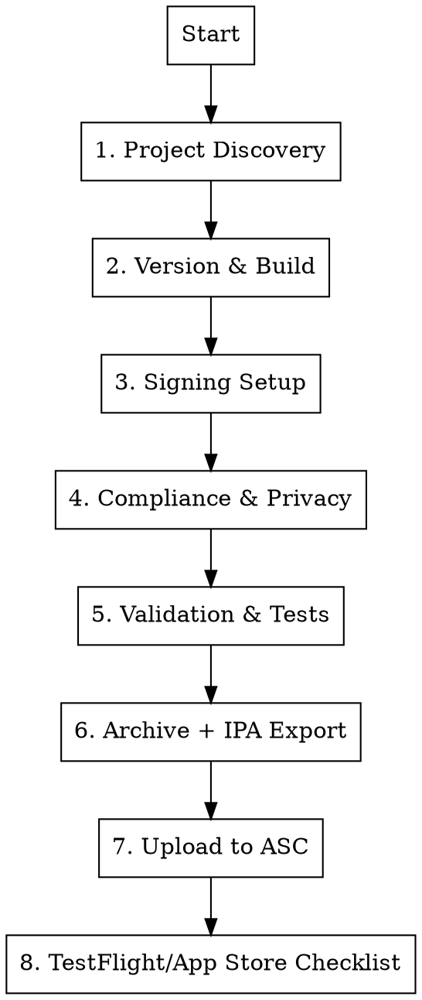

# iOS/iPad Distribution Preparation

## Overview

This skill prepares Apple mobile app distribution for iPhone and iPad, from preflight checks through App Store Connect submission.

Important artifact difference:
- macOS distribution commonly uses `.dmg`
- iOS/iPadOS distribution uses `.ipa` uploaded to App Store Connect (TestFlight/App Store)

## Fast Preflight (Run First)

Use the bundled checker before any release action:

```bash
bash ./skills/osx-ios/scripts/check_ios_dist.sh --app-root <APP_ROOT>
```

If checker output includes `FAIL`, stop and fix blockers first.

## When to Use

- Before any TestFlight build upload
- Before App Store submission/review
- When user asks for iOS/iPad release readiness
- When converting a macOS-only release workflow to mobile distribution

## Required Inputs

Collect these first. If missing, report the gap and stop before release actions.

- App source path and iOS target/scheme
- Xcode version + SDK baseline used for archive
- Apple Developer Team ID
- Bundle identifier (explicit App ID)
- Distribution method: `testflight` or `app-store`
- Version and build number strategy
- App Store Connect app record status (existing/new)
- Privacy policy URL + support URL

## Distribution Workflow

Run each phase in order. Do not skip.



## 1. Project Discovery

Confirm the app has a valid iOS target and release configuration.

- [ ] `ios/` project exists (or native iOS project root)
- [ ] Shared scheme available for CI/reproducible builds
- [ ] Release configuration builds on real device target
- [ ] Bundle ID stable and unique
- [ ] `MinimumOSVersion` is intentional
- [ ] iPad support decision is explicit (`UIDeviceFamily`)
- [ ] Xcode/SDK baseline meets current App Store Connect upload requirements

## 2. Version and Build Number

- [ ] Marketing version (`CFBundleShortVersionString`) set
- [ ] Build number (`CFBundleVersion`) incremented
- [ ] Version/build match App Store Connect expectations
- [ ] Changelog/release notes prepared for TestFlight reviewers

Common commands:

```bash
# Inspect current values
/usr/libexec/PlistBuddy -c "Print :CFBundleShortVersionString" ios/Runner/Info.plist
/usr/libexec/PlistBuddy -c "Print :CFBundleVersion" ios/Runner/Info.plist
```

## 3. Signing Setup (Critical)

App distribution fails without correct signing. Validate all of:

- [ ] Apple Developer Program membership active
- [ ] Distribution certificate available (Apple Distribution)
- [ ] App ID exists and matches bundle identifier
- [ ] Provisioning profile maps to certificate + App ID + Team ID
- [ ] Entitlements match enabled capabilities
- [ ] Automatic or manual signing is consistent across local + CI

If manual signing:
- [ ] `PROVISIONING_PROFILE_SPECIFIER` configured for Release
- [ ] `CODE_SIGN_STYLE=Manual` intentional

If automatic signing:
- [ ] `-allowProvisioningUpdates` usage approved for CI

## 4. Compliance and Privacy

### Permissions and Usage Strings

Each sensitive API must have a clear purpose string.

- [ ] Camera (`NSCameraUsageDescription`)
- [ ] Microphone (`NSMicrophoneUsageDescription`)
- [ ] Photos (`NSPhotoLibraryUsageDescription`, add/read variants if needed)
- [ ] Location (`NSLocationWhenInUseUsageDescription` / always keys if used)
- [ ] Contacts, Calendars, Bluetooth, Motion, etc. when applicable

### Privacy Manifest and SDK Compliance

- [ ] `PrivacyInfo.xcprivacy` valid where required
- [ ] Third-party SDK privacy manifests verified
- [ ] Required-reason APIs have valid reasons
- [ ] Data collection declarations match actual runtime behavior
- [ ] App Tracking Transparency prompt only if tracking is used

### Export Compliance and Legal

- [ ] Encryption declaration ready (App Store Connect export compliance)
- [ ] Privacy policy URL is live
- [ ] Support URL is live
- [ ] Terms/EULA references are valid

## 5. Validation and Tests

Minimum release gates:

- [ ] Clean Release build succeeds
- [ ] Smoke test on physical iPhone
- [ ] Smoke test on physical iPad (or simulator + QA device if limited)
- [ ] Critical flows verified: login, purchase/subscription, sync, offline behavior
- [ ] Crash reporting initialized for Release build
- [ ] No debug menus/log overlays in Release

## 6. Archive and IPA Export

Use archive/export, not DMG packaging.

```bash
# 1) Archive
xcodebuild \
  -workspace ios/Runner.xcworkspace \
  -scheme Runner \
  -configuration Release \
  -destination "generic/platform=iOS" \
  -archivePath build/Runner.xcarchive \
  archive

# 2) Export IPA (app-store method for TestFlight/App Store)
xcodebuild -exportArchive \
  -archivePath build/Runner.xcarchive \
  -exportPath build/ios-dist \
  -exportOptionsPlist ios/ExportOptions.plist
```

`ExportOptions.plist` (minimum):

```xml
<?xml version="1.0" encoding="UTF-8"?>
<!DOCTYPE plist PUBLIC "-//Apple//DTD PLIST 1.0//EN" "http://www.apple.com/DTDs/PropertyList-1.0.dtd">
<plist version="1.0">
<dict>
  <key>method</key>
  <string>app-store</string>
  <key>signingStyle</key>
  <string>automatic</string>
  <key>teamID</key>
  <string>YOUR_TEAM_ID</string>
  <key>uploadBitcode</key>
  <false/>
  <key>uploadSymbols</key>
  <true/>
</dict>
</plist>
```

## 7. Upload to App Store Connect

Preferred options:

- Xcode Organizer upload
- Transporter app upload
- CI upload using App Store Connect API key + transporter tooling

Optional (if `asc` CLI is installed):

```bash
# TestFlight publish
asc publish testflight --app <APP_ID> --ipa <PATH_TO_IPA> --group <GROUP_ID>

# App Store publish
asc publish appstore --app <APP_ID> --ipa <PATH_TO_IPA> --version <VERSION>
```

Checklist:

- [ ] `.ipa` upload completes successfully
- [ ] Build appears in App Store Connect
- [ ] Processing status becomes available
- [ ] Build assigned to internal/external TestFlight group as needed

## 8. iPhone + iPad Submission Checklist

### TestFlight Operational Rules

- [ ] Internal testers <= 100 users
- [ ] External testers <= 10,000 users
- [ ] Build age <= 90 days
- [ ] First external build (and one build per app version) passes Beta App Review
- [ ] Upload pacing respects build limits per 24 hours

### Metadata

- [ ] App name, subtitle, keywords
- [ ] Description + What’s New
- [ ] Category, age rating, content rights
- [ ] Contact info for App Review

### Screenshots and Media

- [ ] Required iPhone screenshots uploaded (current minimum baseline)
- [ ] Required iPad screenshots uploaded if iPad support is enabled
- [ ] Preview videos optional but validated if present

### Device and UX Requirements

- [ ] Orientation support intentional for iPhone and iPad
- [ ] Safe area layouts verified on notched and non-notched devices
- [ ] iPad multitasking behavior validated (if supported)
- [ ] External keyboard/pointer interactions checked where applicable

### Monetization and Account

- [ ] In-app purchases/subscriptions approved or linked
- [ ] Sign in with Apple requirement evaluated
- [ ] Demo/test account credentials provided to reviewer (if required)

### App Review Guideline Alignment

- [ ] App completeness for review (no placeholders/broken flows)
- [ ] Privacy and data handling disclosures match behavior
- [ ] Sign in with Apple implemented when third-party sign-in triggers requirement

## Failure Conditions (Block Release)

Treat these as release blockers:

- Missing/invalid signing profile or certificate
- Missing privacy usage strings for used APIs
- Missing or invalid privacy manifest / required-reason API declarations
- Export/upload failures for Release IPA
- Broken privacy policy/support links
- iPad required assets missing while iPad support is enabled
- Release build still using debug endpoints or test secrets

## Output Format

When running this skill, produce:

1. `Readiness Summary`: ready / not ready
2. `Blocking Issues`: concrete file + fix
3. `Non-Blocking Improvements`: prioritized
4. `Exact Next Commands`: deterministic command list

## Current External Baselines to Enforce

- As of April 2026, App Store Connect requires uploads built with Xcode 16 and the current platform SDK baselines (including iOS 18/iPadOS 18 class SDKs).
- TestFlight operational limits apply: internal testers up to 100, external testers up to 10,000, and builds expire after 90 days.
- TestFlight external distribution requires Beta App Review for the first build and one build per app version.
- App Store Connect screenshot minimums follow current policy (single required iPhone size set and single required iPad size set for iPad apps).
- Privacy manifests and required-reason API declarations must be valid, and common third-party SDK signatures/manifests are expected by current platform policy.

## Related Skills

- **osx-review**: deep release-oriented code review
- **osx-compliance**: macOS DMG + desktop release infrastructure
- **osx-models**: native AI framework/model selection when AI features are included
